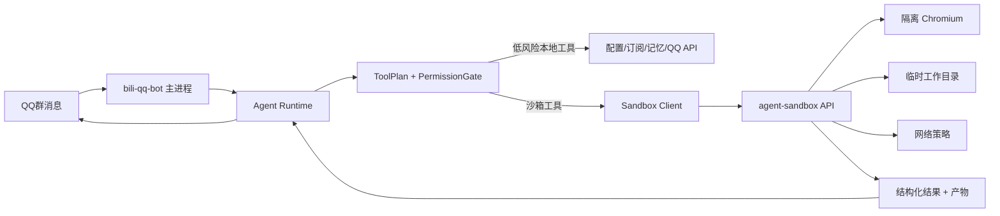

# Agent 沙箱与能力边界优化方案

## 背景

当前 Agent 已具备 LLM 决策、工具计划、权限校验、确认码、QQ 管理、网页读取、网页搜索、网页截图和长期记忆能力。现阶段能力被限制得比较紧，主要原因不是 LLM 本身，而是工具执行都在主 Bot 进程里：一旦放开浏览器、文件、网络或脚本执行，风险会直接影响配置、数据、NapCat 会话和宿主机。

长线目标应改为：主 Bot 进程保持最小权限，危险或不确定能力放进隔离沙箱执行。Agent 可以获得更强的浏览器和临时工作能力，但不能越过权限、确认、审计和资源边界。

## 当前限制点

1. 浏览器能力限制
   - `browser.read_url` / `browser.screenshot_url` 只允许公开 `http/https`。
   - 拒绝 `localhost`、内网 IP、URL 凭证、DNS 解析到内网地址。
   - 截图只能访问公开网页，不能做完整浏览器交互。

2. 工具执行限制
   - LLM 只能输出 `tool_plan`，实际执行由 `ToolRegistry + permissionGate + toolGuardrails` 接管。
   - `medium/high` 风险动作需要确认。
   - QQ 管理、配置、订阅、账号级工具按权限分层。

3. 运行态限制
   - 当前工具都在 `bili-qq-bot` 容器内执行。
   - 该容器挂载了 `config/`、`data/`、`logs/`、`napcat/qq/`，不适合开放 shell、文件浏览或强浏览器自动化。
   - Chromium 当前以 `--no-sandbox` 运行，这是 Docker 内常见做法，但不适合作为 Agent 扩权基础。

## 设计原则

1. 主进程不扩权
   - `bili-qq-bot` 继续只负责消息、配置、权限、确认、审计、工具编排。
   - 不在主进程内开放 shell、任意文件读写、任意浏览器自动化。

2. 沙箱进程可扩能
   - 新增独立 `agent-sandbox` 容器，执行浏览器、网页分析、临时文件处理、可选脚本任务。
   - 沙箱不挂载 `config/`、`data/`、`napcat/qq/`、Docker socket、宿主根目录。

3. 能力分级开放
   - 不是简单“开放/关闭”，而是按能力、目标、权限、风险和资源预算控制。
   - LLM 永远不能直接调用沙箱内部命令，只能提交结构化 job。

4. 结果可审计可复现
   - 每个沙箱任务有 `jobId`、输入摘要、工具名、URL/domain、资源预算、产物路径、耗时、退出原因。
   - 审计记录回写 Agent trajectory。

## 推荐架构



### 新增容器

建议新增 `agent-sandbox` 服务，而不是把主 Bot 容器改成大权限容器。

核心约束：

- `read_only: true`
- `cap_drop: ["ALL"]`
- `security_opt: ["no-new-privileges:true"]`
- 非 root 用户运行
- `pids_limit`、`mem_limit`、`cpus` 限制
- `tmpfs` 提供 `/tmp`、`/run`、`/home/sandbox`
- 只挂载一个产物目录，例如 `./data/agent/sandbox-output:/sandbox/output`
- 不挂载 `config/`、`data/cookies.json`、`napcat/qq`、宿主 Docker socket
- 内部 API 只暴露在 Docker 内网，不映射宿主端口

### 沙箱 API

主 Bot 只通过 HTTP 调用沙箱服务，接口建议：

```text
POST /v1/jobs/browser.read
POST /v1/jobs/browser.screenshot
POST /v1/jobs/browser.interact
POST /v1/jobs/web.extract
POST /v1/jobs/file.convert
GET  /v1/jobs/:jobId
GET  /v1/artifacts/:artifactId
```

统一请求结构：

```json
{
  "jobId": "agent_job_xxx",
  "tool": "browser.screenshot",
  "input": {
    "url": "https://example.com",
    "viewport": { "width": 1280, "height": 900 }
  },
  "policy": {
    "network": "public_web_only",
    "timeoutMs": 20000,
    "maxBytes": 1048576,
    "allowDownloads": false,
    "allowScripts": true
  },
  "trace": {
    "groupId": "1000",
    "userId": "42",
    "traceScope": "msg:1000:42:xxx"
  }
}
```

统一响应结构：

```json
{
  "jobId": "agent_job_xxx",
  "status": "ok|failed|timeout|blocked",
  "reason": "",
  "summary": "页面标题和可见文本摘要",
  "artifacts": [
    { "type": "image", "path": "/sandbox/output/xxx.png", "mime": "image/png" }
  ],
  "metadata": {
    "finalUrl": "https://example.com/",
    "title": "Example Domain",
    "elapsedMs": 1200,
    "networkRequests": 8
  }
}
```

## 能力边界重分层

### A. 主进程硬边界

这些能力不应进入沙箱，也不应让沙箱触达：

- QQ 群管理：禁言、踢人、撤回、审批、全员禁言。
- Bot 配置：Agent 开关、订阅、黑名单、群配置。
- 长期记忆写入和删除。
- NapCat 会话目录、QQ 临时文件目录。
- B 站 cookie 和项目配置文件。

原因：这些能力依赖业务权限，不是操作系统隔离能解决的。必须继续由主进程权限系统控制。

### B. 沙箱增强边界

适合放进沙箱的能力：

1. 浏览器访问
   - 公开网页读取。
   - JS 渲染后截图。
   - 多步骤网页交互，例如点击、滚动、展开内容。
   - 页面可访问性树提取和正文抽取。

2. 网页研究
   - 搜索多个来源。
   - 打开搜索结果并提取摘要。
   - 交叉验证来源，但结果必须标注“不保证事实正确”。

3. 临时文件处理
   - 下载公开文件到沙箱临时目录。
   - 提取 PDF/HTML/图片元信息。
   - 生成临时截图或文本摘要。

4. 受控脚本执行，后续再开放
   - 只在无网络或有限网络策略下运行。
   - 只允许预置解释器和白名单命令。
   - 默认不开放给群聊用户；只给 Root 或特定测试群。

### C. 明确禁止能力

即使有沙箱，也不建议开放：

- 访问内网、Docker 网关、宿主机服务、NapCat HTTP/API。
- 读取或修改主项目目录、配置目录、数据目录。
- 执行持久化后台进程。
- 安装系统包、启动 Docker、访问 Docker socket。
- 代用户登录网页、处理 Cookie、上传私密文件。
- 绕过 QQ/配置工具权限做等价操作。

## 工具分层建议

### Phase S1：沙箱替换现有浏览器工具

目标：不增加新能力，先把现有 `browser.read_url`、`browser.search_web`、`browser.screenshot_url` 从主 Bot 迁移到沙箱执行。

新增/调整：

- `src/services/agentSandboxClient.js`
- `agent-sandbox` 容器服务
- `browser.read_url` 调用沙箱 `browser.read`
- `browser.screenshot_url` 调用沙箱 `browser.screenshot`
- 搜索仍可先在主进程保留，或迁移到沙箱

验收：

- QQ 里网页读取、网页搜索、网页截图行为不退化。
- 主 Bot 容器内不再直接启动 Chromium。
- 沙箱拒绝内网、localhost、凭证 URL。
- 产物只写入 `data/agent/sandbox-output`。

### Phase S2：增加浏览器交互能力

新增工具：

- `browser.open_page`：打开公开网页并返回标题、正文、可交互元素摘要。
- `browser.click_and_extract`：在页面内点击指定文本/元素后抽取内容。
- `browser.scroll_screenshot`：滚动页面并截图。
- `browser.extract_article`：提取主要正文、标题、发布时间和来源。

边界：

- 全部 `risk=medium`。
- 默认需要确认，或者只允许 Root/群管理员使用。
- 每次交互最多 N 步，超时强杀。
- 不允许输入密码、Cookie、token、验证码。

### Phase S3：网页研究能力

新增工具：

- `research.web_search_open`：搜索并打开前 N 个结果，返回多来源摘要。
- `research.source_compare`：比较多个公开 URL 的信息差异。
- `research.cite_sources`：输出回答草稿和来源列表。

边界：

- 只用于公开信息查询。
- 明确标注来源和不确定性。
- 高成本，需要预算限制和群级开关。

### Phase S4：临时文件/代码沙箱能力

谨慎开放，建议最后做。

新增工具：

- `sandbox.run_python`：运行短 Python 片段，用于数据处理或格式转换。
- `sandbox.extract_pdf`：提取公开 PDF 文本和截图。
- `sandbox.transform_image`：轻量图片格式转换、裁剪、压缩。

边界：

- 默认 Root-only 或测试群 allowlist。
- 无网络或仅允许公开网络。
- 只读输入、临时输出、任务结束清理。
- 不允许访问主项目代码和配置。

## Docker Compose 设计草案

```yaml
services:
  agent-sandbox:
    build:
      context: .
      dockerfile: Dockerfile.sandbox
    container_name: agent-sandbox
    restart: unless-stopped
    read_only: true
    cap_drop:
      - ALL
    security_opt:
      - no-new-privileges:true
    pids_limit: 256
    mem_limit: 768m
    cpus: 1.0
    tmpfs:
      - /tmp:size=512m,mode=1777
      - /run:size=64m,mode=755
      - /home/sandbox:size=256m,mode=700
    volumes:
      - ./data/agent/sandbox-output:/sandbox/output
    expose:
      - "3100"
    networks:
      - agent_sandbox_network

  bili-qq-bot:
    environment:
      - AGENT_SANDBOX_URL=http://agent-sandbox:3100
    depends_on:
      - agent-sandbox
    networks:
      - bot_network
      - agent_sandbox_network

networks:
  agent_sandbox_network:
    driver: bridge
```

说明：

- `agent-sandbox` 不加入 `bot_network`，避免直接访问 NapCat。
- `bili-qq-bot` 同时加入两个网络，作为唯一调用方。
- 如果需要进一步限制出网，应在宿主防火墙或容器网络层做 egress policy；单纯 Compose 无法精确限制公网域名。

## 安全策略细节

### URL 安全

沙箱内仍要保留当前 URL 防护：

- 只允许 `http:`、`https:`。
- 禁止 URL 用户名/密码。
- 禁止 localhost、`.localhost`。
- 禁止 IPv4/IPv6 内网、链路本地、回环、0.0.0.0。
- DNS 解析后再次校验 IP。
- 每次重定向后重新校验。
- Browser request interception 对所有子请求重复校验。

### 资源限制

每个 job 应有：

- `timeoutMs`
- `maxNetworkRequests`
- `maxResponseBytes`
- `maxArtifactBytes`
- `maxSteps`
- `maxConcurrency`

超限后返回 `blocked` 或 `timeout`，不让 Chromium 长时间挂住。

### 权限策略

建议把 `use_browser` 拆细：

- `browser_read_public`
- `browser_search_public`
- `browser_screenshot_public`
- `browser_interact_public`
- `sandbox_file_public`
- `sandbox_code_limited`

默认开放顺序：

1. 所有人：搜索、读取公开网页。
2. 群管理员：截图、简单交互。
3. Root：脚本、文件处理、研究型多页面任务。

### 风险等级建议

| 能力 | 风险 | 默认确认 | 说明 |
|---|---:|---:|---|
| `browser.read_url` | low/medium | 否 | 公开网页文本读取，可按群配置开启 |
| `browser.search_web` | low/medium | 否 | 成本可控时无需确认 |
| `browser.screenshot_url` | medium | 是 | 会访问网页并生成图片，存在成本和内容风险 |
| `browser.interact_page` | medium/high | 是 | 多步骤交互，必须限制步数 |
| `research.web_search_open` | medium | 可选 | 多来源访问，成本较高 |
| `sandbox.extract_pdf` | medium | 是 | 下载文件，有资源风险 |
| `sandbox.run_python` | high | 是 + Root/allowlist | 即使沙箱内也必须严格限制 |

## Agent Prompt 与 ToolSpec 调整

Prompt 不应告诉 Agent“你可以自由浏览器操作”，而应表达为：

- 你可以请求受控沙箱工具处理公开网页。
- 不要请求访问内网、登录页、私密链接、Cookie、token。
- 需要多步交互时，先说明目标和预期点击对象。
- 工具结果不是最终事实，回答时要标注来源和不确定性。

ToolSpec 需要增加：

- `executionDomain: local|sandbox|qq|config|memory`
- `networkPolicy: none|public_web_only|restricted`
- `artifactPolicy`
- `resourceBudget`
- `requiresConfirmation`
- `allowedRoles`

## Dashboard 配置建议

新增 Agent 能力页：

- 沙箱总开关。
- 群级浏览器工具开关。
- 每群每日最大网页任务数。
- 截图/交互是否需要确认。
- Root-only 工具 allowlist。
- 最近沙箱任务列表、状态、耗时、阻断原因、产物。

## 实施顺序

1. 设计和配置骨架
   - 增加 `docs/plans` 方案。
   - 明确工具权限拆分和风险矩阵。

2. 沙箱服务最小实现
   - 新增 `Dockerfile.sandbox`。
   - 新增沙箱 HTTP 服务。
   - 实现 `/health`、`browser.read`、`browser.screenshot`。

3. 主 Bot 接入
   - 新增 `agentSandboxClient`。
   - 迁移 `browser.screenshot_url` 到沙箱。
   - 保留主进程 fallback 开关，便于回滚。

4. 交互浏览器能力
   - 增加打开页面、点击、滚动、提取正文。
   - 强制确认和步数限制。

5. 研究能力与评估
   - 多来源搜索打开。
   - 加入群聊回放测试集，验证误用率和成本。

## 关键取舍

1. 不建议把主容器直接改成“强沙箱”
   - 主容器已经挂载业务数据，本质上不是沙箱。
   - 即使加 seccomp/cap_drop，也不能消除业务数据暴露风险。

2. 不建议一步开放 shell
   - 用户感觉“功能被限制住”通常是浏览器能力不足，而不是需要 shell。
   - Shell 应作为后续 Root-only 高风险工具，且最好无网络。

3. 可以先放宽浏览器，不放宽业务权限
   - 浏览器能力适合用容器隔离扩展。
   - QQ 管理、配置、记忆仍必须走现有权限和确认链路。

## 验收清单

- 主 Bot 容器不再直接执行截图 Chromium，或可通过配置切换到沙箱执行。
- 沙箱无法访问 `http://localhost`、`http://127.0.0.1`、Docker 网关、NapCat 服务。
- 沙箱无法读取 `/app/config`、`/app/data/cookies.json`、`/app/.config/QQ`。
- 截图、读取、搜索在 QQ 群内功能可用。
- 每个沙箱 job 在 trajectory 中有完整 span。
- 超时、被阻断、DNS 指向内网、页面空白都有明确错误。
- `high` 风险能力仍强制确认，不能由前端关闭。
