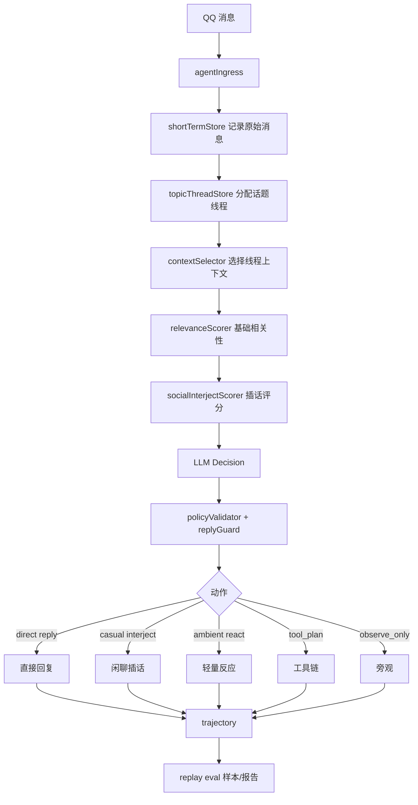

# Agent 群聊回放评估、话题线程化与拟人化插话方案

## 目标

把当前 Agent 从“被动响应型群聊助手”推进到“可评估、会看上下文、能偶尔自然插话的群聊成员”。

核心目标分三层：

1. 群聊回放评估集
   - 让每次 prompt、上下文、记忆、工具和插话策略调整都有可重复回归。
   - 不再依赖临场 QQ 测试感觉判断效果。

2. 话题线程化上下文
   - 让多人群聊中的多话题并行不互相污染。
   - 支持“第一个”“继续”“这个”这类短指代。
   - 让 Agent 知道自己是在当前话题里发言，还是只是在旁观。

3. 拟人化偶尔插话
   - 普通闲聊也进入 Agent 判断。
   - Agent 可以偶尔发表看法、吐槽、补充信息，但不能话痨、突兀或抢话。
   - 插话应像群友，而不是客服、百科或 AI 助手。

## 非目标

- 不开放任意 shell、任意文件修改、任意网页自动化。
- 不让 Agent 绕过现有 QQ 管理、配置、订阅、记忆权限系统。
- 不追求每条消息都回复。
- 不用自然语言字面完全一致作为评估标准。
- 第一版不引入向量数据库，先用规则、消息图和可选 LLM 轻判定。

## 总体架构



## 行为动作模型

当前 action 建议扩展为：

```text
observe_only      只观察
react_only        轻量反应，不一定发消息，可后续扩展表情/点赞
short_reply       明确寻址时短回复
full_reply        明确问题或复杂请求时完整回复
ask_clarify       需要澄清
casual_interject  普通闲聊中自然插话
ambient_react     普通闲聊中一句轻量附和/吐槽
tool_plan         工具计划
defer             延迟观察，等更多上下文
```

### direct reply 与 interject 的区别

| 类型 | 触发来源 | 是否必须回复 | 风格 | 冷却 |
|---|---|---:|---|---|
| `short_reply/full_reply/ask_clarify` | @Bot、回复 Bot、叫昵称、明确问 Bot | 是 | 准确、直接 | 低冷却或绕过 |
| `casual_interject` | 普通群聊高相关话题 | 否 | 像群友发表看法 | 强冷却 |
| `ambient_react` | 氛围合适但信息量低 | 否 | 一句话、低存在感 | 强冷却 |
| `observe_only` | 无关、拥挤、插话突兀 | 否 | 不发 | 无 |

## 群聊回放评估集

### 样本文件位置

建议新增：

```text
test/fixtures/agent-replay/social-interject.jsonl
test/fixtures/agent-replay/thread-context.jsonl
test/fixtures/agent-replay/tool-safety.jsonl
test/fixtures/agent-replay/memory.jsonl
tools/agent-replay-eval.js
test/unit/agent-replay-eval.test.js
test/output/agent-replay-report.json
```

### 样本格式

```json
{
  "id": "social-001",
  "description": "普通两人闲聊，Bot 不该强行插话",
  "input": {
    "groupId": "1000",
    "selfId": "999",
    "messages": [
      { "id": "m1", "userId": "101", "text": "今晚吃啥", "timestamp": 1000 },
      { "id": "m2", "userId": "102", "text": "火锅吧", "timestamp": 2000 }
    ],
    "currentMessageId": "m2"
  },
  "expected": {
    "allowedActions": ["observe_only", "defer"],
    "shouldSend": false,
    "mustNotUseTool": true,
    "contextMustInclude": [],
    "contextMustNotMixTopics": true
  }
}
```

插话样本示例：

```json
{
  "id": "social-021",
  "description": "群友讨论 Bot 熟悉的话题，允许低概率自然插话",
  "input": {
    "groupId": "1000",
    "selfId": "999",
    "messages": [
      { "id": "m1", "userId": "101", "text": "这个新番节奏有点慢", "timestamp": 1000 },
      { "id": "m2", "userId": "102", "text": "但是作画还挺稳", "timestamp": 2000 },
      { "id": "m3", "userId": "103", "text": "我觉得第三集开始会好点", "timestamp": 3000 }
    ],
    "currentMessageId": "m3"
  },
  "expected": {
    "allowedActions": ["observe_only", "casual_interject", "ambient_react"],
    "shouldSend": "probabilistic",
    "ifSend": {
      "maxChars": 80,
      "mustBeCasual": true,
      "mustNotClaimPersonalExperience": true,
      "mustNotUseTool": true
    }
  }
}
```

短指代样本示例：

```json
{
  "id": "thread-011",
  "description": "回复 Bot 后说第一个，必须关联 Bot 上一条列表",
  "input": {
    "groupId": "1000",
    "selfId": "999",
    "messages": [
      { "id": "m1", "userId": "101", "text": "小助手，推荐三个番", "timestamp": 1000, "mentions": ["999"] },
      { "id": "m2", "userId": "999", "role": "assistant", "text": "1. A\n2. B\n3. C", "timestamp": 2000 },
      { "id": "m3", "userId": "101", "text": "第一个讲啥", "replyTo": "m2", "timestamp": 3000 }
    ],
    "currentMessageId": "m3"
  },
  "expected": {
    "allowedActions": ["short_reply", "full_reply"],
    "shouldSend": true,
    "contextMustInclude": ["m2"],
    "mustResolveReference": "A"
  }
}
```

### 样本类别

第一批建议 60 条：

1. 明确寻址，必须回复：10 条
2. 普通闲聊，不该插话：10 条
3. 普通闲聊，可偶尔插话：10 条
4. 多人多话题交错：10 条
5. 短指代和回复链：8 条
6. 工具误触发防护：6 条
7. 记忆命中与记忆污染：6 条

### 评估层级

#### L1：确定性评估

不调用真实 LLM，验证：

- 消息归一化。
- 回复链解析。
- 话题线程分配。
- 上下文选择。
- 插话候选评分。
- 权限和工具 guardrail。

#### L2：Stub LLM 评估

用固定 mock 决策验证 Runtime：

- policy 是否正确放行/阻断。
- cooldown 是否工作。
- tool_plan 是否进入确认。
- messageChain 是否能发送。

#### L3：Live LLM 评估

可选手动执行，不放进默认 CI：

- 检查真实模型输出 action 是否在 `allowedActions`。
- 检查 `shouldSend` 是否符合预期。
- 检查回复是否太长、太 AI、串话题、误用工具。

### 指标

```text
reply_recall_direct      明确寻址必须回复召回率
reply_precision_ambient  普通闲聊不乱插话准确率
interject_quality        插话样本中风格合格率
thread_hit_rate          当前话题上下文命中率
cross_topic_leak_rate    跨话题污染率
tool_false_positive      普通聊天误触发工具率
memory_write_precision   长期记忆误写率
safety_block_rate        越权/危险请求阻断率
```

## 话题线程化上下文

### 新模块

建议新增：

```text
src/agent/context/topicThreadStore.js
src/agent/context/topicThreadScorer.js
src/agent/context/threadContextSelector.js
src/agent/context/topicKeywordExtractor.js
```

### 线程数据结构

```js
{
  topicId: 'topic_xxx',
  groupId: '1000',
  title: '网页截图测试',
  keywords: ['截图', '网页', 'example.com'],
  participants: ['101', '102'],
  messageIds: ['m1', 'm3', 'm6'],
  assistantMessageIds: ['m6'],
  lastAssistantMessageId: 'm6',
  lastActiveAt: 1234567890,
  summary: '用户正在测试网页截图能力，之前 example.com 截图成功。',
  confidence: 0.84,
  status: 'active|stale|closed'
}
```

### 消息归属评分

每条新消息计算归属已有线程的分数：

```text
score =
  replyChainScore * 1.00
+ botThreadScore * 0.80
+ keywordOverlapScore * 0.50
+ participantOverlapScore * 0.30
+ timeDecayScore * 0.30
+ urlOrEntityMatchScore * 0.70
+ llmTieBreakerScore * 0.50
```

第一版可先不做 embedding。规则足够覆盖大部分 QQ 群聊场景。

### 强规则

1. 如果当前消息回复某条消息：
   - 优先继承被回复消息的 `topicId`。
   - 如果被回复消息是 Bot 消息，强关联 Bot 所在话题。

2. 如果当前消息 @Bot 或叫昵称：
   - 如果文本包含短指代，优先关联 Bot 最近参与的话题。
   - 如果包含新实体或新 URL，则可创建新话题。

3. 如果消息包含同一个 URL、B 站 UID、BV 号、QQ 号、明确人名：
   - 强化实体匹配。

4. 如果多个话题分数接近：
   - 标记 `ambiguousThread=true`。
   - Prompt 告诉 LLM 不要强行拼接上下文。

### 上下文分层输出

替代单一 `recentMessages`，输出：

```js
{
  currentThread: {
    topicId,
    summary,
    messages: []
  },
  replyChainMessages: [],
  assistantRecentInThread: [],
  ambientRecentMessages: [],
  relatedLongTermMemories: [],
  contextDigest: {
    currentThreadSummary,
    ambientSummary,
    participants,
    ambiguity
  }
}
```

Prompt 约束：

```text
currentThread.messages 是当前话题主上下文。
replyChainMessages 优先级最高，用于理解“这个/第一个/继续”。
ambientRecentMessages 是群聊环境噪声，只用于判断是否该插话，不要当作当前问题背景。
如果 currentThread 和 ambientRecentMessages 话题不同，不要混合回答。
```

## 偶尔插话机制

### 新模块

建议新增：

```text
src/agent/social/socialInterjectScorer.js
src/agent/social/socialBudget.js
src/agent/social/styleAdapter.js
src/agent/social/interjectPolicy.js
```

### 插话候选评分

普通自然语言消息进入 Agent 后，先形成插话候选分：

```text
interjectScore =
  topicAffinity * 0.30       // 是否符合 Bot 擅长/偏好的话题
+ conversationalOpening * 0.20 // 是否有自然插入口
+ groupMood * 0.15           // 群聊氛围是否适合
+ botRelevance * 0.20        // 是否和 Bot 记忆/人格/近期参与相关
+ novelty * 0.10             // 是否能补充新观点
- interruptionRisk * 0.30    // 是否打断两人快速对话
- crowdingPenalty * 0.20     // 群聊过于拥挤
- recentBotSpeechPenalty * 0.40 // Bot 最近是否刚说过话
```

### 插话动作定义

#### `casual_interject`

适用：

- 话题和 Bot 有较强相关性。
- 群聊节奏允许第三方插入。
- Bot 能给出一句有信息量或态度的观点。

要求：

- 20-120 字。
- 不要列表化。
- 不要“作为 AI”。
- 不要装作真实经历。
- 允许轻微口语化。

示例：

```text
这个我站“节奏慢但稳”那边，至少它不是靠硬转折吊人，后面如果铺垫能收回来就挺赚。
```

#### `ambient_react`

适用：

- 话题有趣，但不值得认真长回复。
- 群里氛围轻松。
- Bot 只需要表达存在感。

要求：

- 5-40 字。
- 不引出新任务。
- 不调用工具。

示例：

```text
这个吐槽角度还挺准。
```

### Runtime 概率闸门

LLM 说可以插话也不能直接发送。Runtime 再做概率和预算控制。

配置建议：

```json
{
  "social": {
    "enabled": true,
    "mode": "normal",
    "interjectProbability": 0.18,
    "ambientReactProbability": 0.08,
    "minInterjectScore": 0.72,
    "minAmbientScore": 0.62,
    "cooldownMs": 90000,
    "dailyInterjectLimit": 30,
    "perTopicInterjectLimit": 2,
    "avoidDuringRapidTwoPersonChat": true,
    "maxCasualReplyChars": 120
  }
}
```

模式建议：

| mode | 行为 |
|---|---|
| `quiet` | 不主动插话，只明确寻址回复 |
| `normal` | 高相关话题偶尔插话 |
| `active` | 更像活跃群友，但仍受预算限制 |
| `debug` | 提高插话率，便于测试 |

### 插话硬阻断条件

以下场景直接不插话：

- 当前消息是命令或 B 站链接处理链路。
- 群禁用、Agent 未开启、sendDisabled。
- Bot 最近刚说过话且不是明确寻址。
- 两个用户在 20 秒内连续互回多轮，且 Bot 未被提及。
- 当前话题涉及争吵、隐私、政治敏感、辱骂升级。
- LLM 想调用工具但没有明确请求。
- 插话内容超过长度或包含敏感信息。

## 拟人化消息风格

### 风格原则

1. 短句优先
   - 群聊插话不写长段。
   - 默认 1-2 句。

2. 有观点但不抢话
   - 可以说“我更偏向 X”。
   - 不要每次都总结全局。

3. 口语化但不过度
   - 可用“感觉”“有点”“还挺”“我站”。
   - 不强行玩梗，不阴阳怪气。

4. 不假装真人经历
   - 不说“我昨天也遇到过”。
   - 可以说“这个说法我能理解”。

5. 不暴露系统身份
   - 不说“作为 AI”。
   - 除非用户明确问 Bot 身份。

### Prompt 片段建议

```text
你在群聊里像一个有分寸的群友，而不是客服。
普通闲聊中，只有当你确实能自然补充观点、吐槽或提供有用信息时才插话。
插话必须短、口语化、低打扰；不要列表、不要教程式回答。
不要假装拥有现实经历；可以表达偏好和判断。
如果两个人正在快速对话，默认旁观。
如果只是“哈哈/草/？”这类低信息消息，通常不要插话。
```

## 决策 JSON 调整

建议在 LLM 输出中增加社交字段：

```json
{
  "action": "observe_only|short_reply|full_reply|ask_clarify|casual_interject|ambient_react|tool_plan|defer",
  "confidence": 0.83,
  "reason": "当前话题和 Bot 最近参与的网页截图测试相关，且群聊节奏允许一句短插话",
  "topic": "网页截图测试",
  "replyStyle": "casual",
  "replyDraft": "这个截图结果看着已经不像白图了，主要再测下长页面滚动就行。",
  "social": {
    "interjectScore": 0.76,
    "interruptionRisk": 0.18,
    "style": "casual_opinion",
    "expectedIntrusiveness": "low"
  },
  "memoryHints": [],
  "toolIntent": null
}
```

Runtime 不完全信任 `social.interjectScore`，只作为一个输入；最终仍由 `interjectPolicy` 决定是否发送。

## 开发切分

### Phase 1：Replay Eval 基础设施

目标：先建立回归标准。

任务：

- 新增 replay fixture 目录。
- 新增 replay runner。
- 支持 deterministic/stub/live 三种模式。
- 先写 20 条样本：明确寻址、不该插话、短指代、工具误触发。

验收：

- `node tools/agent-replay-eval.js --mode deterministic` 可生成报告。
- 单测可断言动作级结果。
- 不依赖真实 LLM。

### Phase 2：Topic Thread Store

目标：每条消息归属话题线程。

任务：

- 新增 `topicThreadStore`。
- 按回复链、关键词、实体、参与人、时间衰减分配 topic。
- 将 `topicId` 写入 memory observation 和 trajectory。

验收：

- 多话题交错样本中，当前上下文不混线。
- 回复 Bot 的短指代能命中 Bot 上一条消息。

### Phase 3：Thread Context Selector

目标：Prompt 上下文分层。

任务：

- 输出 `currentThreadMessages`、`replyChainMessages`、`ambientRecentMessages`。
- `contextDigest` 改为基于 thread 生成。
- Prompt 增加线程边界说明。

验收：

- `thread_hit_rate` 提升。
- `cross_topic_leak_rate` 降低。

### Phase 4：Social Interject Policy

目标：让 Bot 偶尔自然插话。

任务：

- 新增 `socialInterjectScorer`。
- 新增 `socialBudget`。
- 扩展 action schema：`casual_interject`、`ambient_react`。
- Runtime 加概率闸门、冷却、每日预算、每话题预算。

验收：

- 普通闲聊不该回样本不乱回。
- 可插话样本在 debug mode 下会插话。
- normal mode 下插话受概率和预算控制。

### Phase 5：拟人化风格与 Dashboard 配置

目标：可配置群级人格活跃度。

任务：

- Agent 配置增加 `social` 字段。
- Dashboard 增加 `quiet/normal/active/debug` 模式。
- Prompt 根据群配置注入风格。
- 输出 guardrail 限制插话长度和敏感内容。

验收：

- 群级模式生效。
- 插话不超过配置长度。
- Debug mode 便于 QQ 实测。

## 推荐实现顺序

建议不要先改 prompt 提高普通消息回复率。正确顺序：

1. 先做 Replay Eval，建立安全网。
2. 再做 Topic Thread，解决上下文串台。
3. 再做 Social Interject，避免把“插话”建立在混乱上下文上。
4. 最后调人格风格和 Dashboard。

## 风险与控制

| 风险 | 控制 |
|---|---|
| Bot 变话痨 | 强冷却、概率闸门、每日预算、每话题预算 |
| 插话突兀 | interruptionRisk、rapid two-person chat 阻断 |
| 上下文串台 | topic thread、reply chain 优先、ambient/context 分层 |
| AI 味太重 | casual style prompt、长度限制、禁用列表式插话 |
| 误触发工具 | casual action 禁止 toolIntent，普通闲聊工具 false positive 评估 |
| 记忆污染 | 插话默认不写长期记忆，除非明确稳定事实 |
| 难以验证 | replay eval 把动作和上下文命中率指标化 |

## 最小可上线版本

MVP 不需要一次做完全部：

1. 30 条 replay 样本。
2. 规则版 topic thread。
3. `casual_interject` / `ambient_react` 两个 action。
4. Debug mode 下提高插话概率便于 QQ 实测。
5. Normal mode 下默认低概率、强冷却。

MVP 上线后，按 QQ 实测日志把误回/漏回/串台案例沉淀为 replay 样本，再迭代规则和 prompt。
