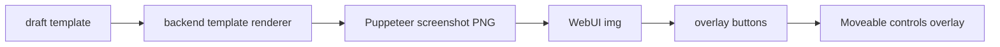
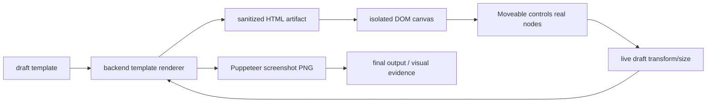

# 2026-06-04 Preview Layout Live DOM Editor Alignment Plan

## 背景

当前 `/preview-layout` 已经把默认预览修回真实 renderer 视觉，但交互层仍存在设计器级问题：

- 拖动框与预览图中真实元素位置不一致。
- 拖动/缩放时只有 overlay 框在移动，真实预览内容不动。
- 移动后必须等待后端重新截图，无法在页面内即时看到移动效果。
- 缺少稳定的自动对齐、边缘/中心线吸附、画布边界吸附。

根因不是单个 CSS 或 Moveable 参数问题，而是当前编辑画布架构是“PNG 预览图 + 透明 overlay button”。Moveable 绑定的是 overlay button，不是后端 renderer 输出的真实元素 DOM。真实内容存在于 PNG 像素里，拖动时无法被浏览器直接更新，只能等 Puppeteer 重新生成图片。因此 overlay 坐标、缩放比例、滚动容器、截图 natural size 之间只要有一个换算不一致，就会出现框和内容脱节。

本方案目标是把预览编辑器从“图片标注器”升级为“同 renderer 的实时 DOM 编辑画布”：前端编辑目标必须是后端 template renderer 输出的真实 HTML DOM，PNG 只保留为最终出图/真实推送/视觉回归证据。

## 硬约束

- 不重写 B 站链接解析。
- 不重写 QQ/NapCat 消息发送链路。
- 不替换 Puppeteer 截图引擎。
- 不把主出图链路改成 Canvas。
- 不允许用户输入任意 HTML/CSS/JS。
- WebUI 预览和真实 QQ 推送仍必须共用同一后端 template renderer。
- 所有模板输入仍由后端 schema/normalizer 校验。
- `video/dynamic/article/live/bangumi/user` 全类型必须保持可编辑、可预览、可保存。

## 市面方案调研结论

### react-moveable

适合保留。Moveable 的定位是直接控制 DOM/SVG 元素，支持 draggable/resizable/snappable/group/bounds/guidelines 等能力。它能提供：

- `snappable`
- `snapContainer`
- `bounds`
- `verticalGuidelines`
- `horizontalGuidelines`
- `elementGuidelines`
- `snapThreshold`
- `snapDirections` / `elementSnapDirections`

问题是当前 target 选错了：Moveable 控制的是 overlay button，而不是真实 renderer DOM。正确用法是让 Moveable target 指向真实 HTML 画布中的 `data-template-node-id` 元素。

### interact.js

interact.js 的 `snap`、`snapSize`、`snapEdges`、restrict modifier 很完整，适合作为底层拖拽手势引擎。但它不提供现成的设计器选择框、多选控制柄和 guideline 体验。如果替换 Moveable，需要重做较多 UI 能力。当前不建议替换。

### react-rnd

适合简单窗口/卡片拖拽缩放，支持 `dragGrid`、`resizeGrid`、`scale`。但它偏组件级位置管理，不适合当前需要的 sibling element guideline、中心线、边缘、容器吸附、多选和复杂 DOM target。

### react-grid-layout

适合 dashboard 网格布局，有序列化、响应式、拖拽、缩放、边界检查。但当前 B 站预览卡不是规则网格，而是 legacy renderer HTML + flow layout + 局部 transform，不应改成 grid dashboard 模型。

### GrapesJS / Craft.js

这类页面编辑器的核心模式值得借鉴：组件模型是 source of truth，canvas 中直接渲染组件视图，用户拖动后 canvas 立即更新。它们说明成熟编辑器不会用静态截图作为交互对象，而是把可编辑 DOM/组件树作为交互对象，再用同一模型导出最终结果。

### Konva / Fabric

Canvas 编辑体验成熟，但会把编辑面转成 Canvas/矢量对象，和“不把主出图链路改成 Canvas”的约束冲突。本任务不采用。

## 目标架构

### 当前架构



问题：Moveable 控制的是 E，不是 B 生成的真实元素。

### 目标架构



核心变化：

- 后端 renderer 继续是唯一真源。
- 后端新增受控 HTML artifact 输出，用同一 renderer 生成，不接受用户 HTML。
- 前端 canvas 使用该 HTML artifact 渲染真实 DOM。
- Moveable target 绑定真实 DOM 中的 `data-template-node-id` 元素。
- 拖动/缩放时先即时更新 DOM 和本地 draft，再 debounce 或手动重新请求 PNG。

## 现状澄清(执行前必读)

### previewLayout 与 previewTemplate 的关系与取舍

当前仓库中存在两套并行的 layout 子系统,本方案必须基于其一,不能含糊:

- `/src/services/previewLayout/`(legacy,patch 式):把编辑结果建模为按语义 key(`data-layout-key`,例如 `cover`/`header`/`avatar`/`typeBadge`/`content`/`root`)索引的扁平 override patch,作用在 `imageGenerator/renderers/*.js` 手写渲染器输出的 HTML 上。
- `/src/services/previewTemplate/`(新一代,template 式):把整张卡片建模为节点树(`template.nodesById`/`childrenByParentId`),由 `renderer.js`(`renderTemplateArtifacts`/`renderGenericNode`/`renderTemplateBody`)统一渲染,每个节点带唯一 `data-template-node-id`。

**`previewTemplate` 是当前 `/preview-layout` 的主路径与唯一真源**:`src/dashboard/routes/api/modules/preview-layout.js` 的 `preview`/`config`/`reset`/`template/validate` 等路由都围绕 `getEffectiveTemplate`/`savePreviewTemplate`/`saveLegacyPatchAsTemplate`/`resetPreviewTemplate`/`normalizeTemplate` 运作;`generatePreviewCardArtifacts()` 在存在 `draftTemplate`/`getEffectiveTemplate` 时调用 `renderTemplateArtifacts`,只有在没有有效 template 时才回退到 `previewLayout` 的 `getSavedEffectiveLayout`/`buildPreviewLayoutOverrideCss`/`collectPreviewLayoutElementMetadata` legacy 路径。

`previewTemplate/migrator.js`(`migrateV1PatchToTemplate`/`mapV1ElementToNode`/`migratePreviewLayoutPatchToTemplate`)是两者之间的桥梁:把旧版按语义 key 索引的 V1 patch 转换为新的节点树 template,并通过 `isLegacyRole`/`getRolePolicy`/`requiredRoles`/`resizableRoles` 等角色策略把旧 override 映射到匹配的节点上,从而让历史保存的 patch 与 `renderOverrides` 请求在新引擎下继续可用。

`previewLayout` 目前**仍是 load-bearing,不能视为可删除的死代码**:它承担 legacy patch 输入的 schema/校验/归一化(`normalizePreviewLayoutPatch`/`assertJsonSize`/`LIMITS`/`getPreviewLayoutSchema`/`getElementSchema`/`isEditableType`),是 `generatePreviewCardArtifacts` 的回退渲染路径,且手写渲染器(`video.js`/`live.js`/`article.js` 等)仍在输出 `data-layout-key`,模板渲染器自身在根包装节点上也保留了 `data-layout-key="root"`(`renderer.js:131`)以维持向后兼容。

**结论与约束:本方案的 HTML artifact 能力与 live DOM canvas 一律基于 `previewTemplate` 构建**,`renderTemplateArtifacts()`/`renderTemplateHtmlArtifact()` 是 Phase 1 的扩展入口;`previewLayout` 仅作为旧 patch 的校验/迁移/回退路径继续存在,不在本方案的改造范围内,迁移路径继续交给现有 `migrator.js`。Phase 1 的实施步骤第 1 条应理解为"在 `previewTemplate/renderer.js` 中新增 `renderTemplateHtmlArtifact()`",而不是泛指"在 template renderer 中"。

### `data-template-node-id` 与 `data-layout-key` 的区分及取舍

二者是**两个不同概念**,不是同一 ID 的两种写法:

- `data-layout-key`:**语义/角色级稳定 key**(如 `cover`/`header`/`avatar`/`typeBadge`/`content`/`root`),硬编码在 `imageGenerator/renderers/{video,live,article,user,dynamic,bangumi}.js` 等手写渲染器中,被 `previewLayout/elementMetadata.js`(`collectPreviewLayoutElementMetadata`/`getEditableElementKeys`)与 `previewLayout/css.js` 消费。同一语义槽位在不同实例间始终携带相同 key,但只覆盖固定的一组"角色"元素,无法覆盖用户新增的通用/自定义节点。
- `data-template-node-id`:**模板实例级唯一节点 ID**(`node.id`,如 `template.rootId`),由 `previewTemplate/renderer.js` 在渲染时生成并注入(`attrs()`、`injectTemplateIds`、根节点包装,约 18/86-87/131 行),被 `previewTemplate/metadata.js`(`collectPreviewTemplateMetadata`)与 `previewTemplate/css.js` 的 override 选择器(`[data-template-node-id="${id}"]`)消费。它覆盖节点树中的每一个节点,包括没有固定语义角色的通用/自定义节点,且是 override CSS 与 metadata 采集已经在用的寻址单元。

**Live DOM canvas 的 Moveable target 映射必须以 `data-template-node-id` 为唯一键**:它是新模板渲染器在每个节点上都会输出的标识符(覆盖范围完整,包含自定义节点),是现有 override-CSS/metadata 采集路径已经依赖的寻址方式,也将是未来 HTML artifact 输出中保持稳定的寻址单元。`data-layout-key` 应被当作面向旧手写渲染器/legacy 兼容的辅助标记,只用于诊断或迁移对照,不参与拖动框的节点映射;不要在 nodeId -> DOM 映射逻辑中混用两套 key。

### 现有测试基础设施(更正"测试命令"一节中的假设)

复核代码库后确认,"测试命令"一节列出的以下文件**均已存在**,不需要新建:

- `test/unit/preview-template/` 目录已存在,包含 `preview-template-bindings.test.js`、`preview-template-merge.test.js`、`preview-template-migrator.test.js`、`preview-template-normalizer.test.js`、`preview-template-renderer.test.js`、`preview-template-schema.test.js`
- `test/unit/dashboard/dashboard-preview-layout-api.test.js` 已存在
- `test/unit/rendering/preview-template-rendering.test.js` 已存在
- 另有 `test/unit/dashboard/preview-layout-editor-source.test.js`、`test/unit/rendering/preview-layout-video-rendering.test.js`、`test/unit/preview-layout/preview-layout-core.test.js` 等相邻测试可参考

因此 Phase 1/6 的验证工作是**扩展/更新现有测试文件**,而不是新建:

- 在 `preview-template-renderer.test.js` 中补充 `data-template-node-id` 稳定性、`renderTemplateHtmlArtifact()` 输出结构与安全过滤的用例
- 在 `dashboard-preview-layout-api.test.js` 中补充 `artifactMode: "image+html"` 请求/响应契约的用例
- 在 `preview-template-rendering.test.js` 中补充 HTML artifact 渲染回归用例
- 若确有必要新增独立的 artifact 生成测试文件,按现有命名约定建为 `test/unit/preview-template/preview-template-artifacts.test.js`

## 后端方案

### 1. 新增 HTML artifact 能力

在现有 `generatePreviewCardArtifacts()` 或其下层 renderer 中增加可选输出：

```js
{
  image: { base64, mime },
  htmlArtifact: {
    html,
    css,
    container: { width, height },
    elements: metadata,
    renderer: "preview-template-v2"
  }
}
```

要求：

- `html/css` 只能来自本仓库 renderer 产物，不接收用户原始 HTML/CSS。
- 所有用户文本继续 escape。
- 所有图片 URL 继续走受控 URL 校验和 placeholder 策略。
- 禁止 script、event handler、外部 stylesheet、任意 inline CSS 字符串。
- CSS 只包含 renderer 生成的 legacy CSS + template safe override CSS。
- 保留 `data-template-node-id` 与 `data-layout-key`。

### 2. 新增或扩展 preview API

方案 A：扩展现有接口。

`POST /api/preview-layout/preview`

新增请求字段：

```json
{
  "artifactMode": "image+html"
}
```

响应中增加：

```json
{
  "htmlArtifact": {
    "html": "...",
    "css": "...",
    "container": { "width": 1000, "height": 1260 },
    "elements": {}
  }
}
```

方案 B：新增只读 HTML artifact 接口。

`POST /api/preview-layout/preview-html`

优点是避免现有 preview 响应过重；缺点是前端可能需要并发请求。推荐先用方案 A，减少 API 分叉。

### 3. sandbox 安全策略

前端不应把 artifact 插入主 DOM。推荐用 iframe：

```html
<iframe sandbox="" srcdoc="..."></iframe>
```

iframe 内容由前端拼接：

```html
<!doctype html>
<html>
  <head>
    <style>/* server generated safe CSS */</style>
  </head>
  <body>
    <!-- server generated safe HTML -->
  </body>
</html>
```

约束：

- `sandbox=""`，默认禁用脚本、表单、同源能力。
- 不加 `allow-scripts`。
- 不加 `allow-forms`。
- 不加 `allow-same-origin`，除非后续证明必须；如必须，需要额外 threat review。
- 通过 iframe `contentDocument` 查询节点；若 sandbox 无同源访问受限，则改用 shadow root isolated container。优先验证 iframe 可行性。

注意：如果完全 sandbox 后父页面无法访问 `contentDocument`，可选方案是使用主 DOM 内 isolated root：

```html
<div class="preview-live-dom-sandbox">
  <style scoped/generated>
  <div class="preview-card-root">...</div>
</div>
```

该方案必须通过 CSS 前缀隔离，所有 CSS selector 由后端包在 `.preview-live-dom-sandbox` 下，避免污染 dashboard。

## 前端方案

### 1. 画布模式拆分

新增两种显示层：

- Live DOM Canvas：默认编辑面，承载真实 renderer DOM，Moveable 绑定真实节点。
- PNG Proof：最终输出对照，可折叠/切换，用于确认真实 Puppeteer 截图与 live DOM 一致。

不再使用 PNG overlay button 作为主要编辑目标。旧 overlay metadata 可保留为诊断层，但不参与拖动。

### 2. DOM target 映射

每次收到 `htmlArtifact` 后：

1. 渲染 artifact 到 iframe/isolation root。
2. 查询所有 `[data-template-node-id]`。
3. 建立 `nodeId -> HTMLElement` 映射。
4. 选中节点时，Moveable target = 对应真实 HTMLElement。
5. metadata 只用于属性面板初始值、对齐计算和后端校验，不再作为拖动框 DOM。

### 3. 坐标系统统一

定义唯一坐标合同：

- template/layout 中保存的 transform/width/height 使用 natural renderer coordinate。
- Live DOM canvas 以 natural width 渲染，再通过 CSS scale 适配页面宽度。
- Moveable 的 `zoom` 或 delta 换算必须使用同一个 `canvasScale`。

计算：

```js
canvasScale = displayedCanvasWidth / artifact.container.width
naturalDelta = cssDelta / canvasScale
```

禁止：

- 用 overlay 百分比反推坐标。
- 同时混用 image natural size、DOM displayed size、metadata percent 三套坐标。
- 拖动结束时从 stale metadata 取 box 再叠加 CSS transform。

### 4. 拖动实时反馈

拖动开始：

- 记录 nodeId、初始 layout、初始 DOM rect、canvasScale。
- 生成 interaction state，不立即请求后端。

拖动中：

- 对目标真实 DOM 应用临时 style：
  - core flow node：`transform: translate(...)`。
  - generic absolute node：更新 `left/top` 或 transform，按当前 DSL 合同决定。
- 同步更新 Moveable 控制框。
- 更新属性面板里的 x/y draft 值。
- 显示 smart guide 线。
- 不触发 Puppeteer。

拖动结束：

- 将自然坐标 delta 写入 draft template。
- 标记 `previewOutdated`。
- debounce 触发 lightweight HTML artifact refresh，或等待用户点击“应用预览”。
- 需要生成 PNG 时再调用 full preview。

### 5. 缩放实时反馈

缩放开始：

- 记录初始 width/height、DOM rect、node layout。

缩放中：

- 直接更新目标 DOM 的 width/height。
- 对 image 节点保持比例时使用 Moveable `keepRatio`。
- 对 legacy core 节点只允许 schema 允许的 resizable roles。
- 同步更新属性面板。

缩放结束：

- 写入 natural width/height。
- 标记 `previewOutdated`。
- 重新请求 HTML artifact 校准。

### 6. 自动对齐与吸附

使用 Moveable 原生 snappable 能力。

基本配置：

```jsx
<Moveable
  target={selectedLiveElement}
  draggable
  resizable
  snappable
  snapContainer={liveCanvasElement}
  bounds={{ left: 0, top: 0, right: canvasWidth, bottom: canvasHeight }}
  snapThreshold={8}
  verticalGuidelines={verticalGuidelines}
  horizontalGuidelines={horizontalGuidelines}
  elementGuidelines={elementGuidelines}
  snapDirections={{ left: true, center: true, right: true, top: true, middle: true, bottom: true }}
  elementSnapDirections={{ left: true, center: true, right: true, top: true, middle: true, bottom: true }}
/>
```

Guideline 来源：

- 画布左/中/右、上/中/下。
- card 左/中/右、上/中/下。
- content 左/中/右、上/中/下。
- sibling 节点边缘和中心线。
- 选中多节点时，其他选中节点的 group bounds。
- 可选 8px grid。

交互规则：

- 默认开启 smart guides。
- 按住 `Alt/Option` 临时关闭吸附。
- 按住 `Shift` 限制水平/垂直移动。
- 属性面板提供“吸附”开关、“网格 8px”开关。

### 7. 多选

短期目标：

- 多选仍可选择多个 DOM target。
- Moveable group target 绑定多个真实节点。
- group drag 实时移动所有节点。
- group resize 可先不开放，避免 legacy flow 节点复杂变形。

完成标准：

- 多选拖动框与真实节点一致。
- group drag 写回每个节点的 natural transform。
- align/distribute 使用 live DOM rect，不使用 stale PNG metadata。

### 8. 与 dnd-kit 的边界

dnd-kit 继续只负责节点树/层级/容器排序，不负责画布上的自由拖动。

边界：

- 树内排序：dnd-kit。
- 画布节点移动/缩放/吸附：Moveable。
- 跨容器结构变更：dnd-kit 或组件库 drop。
- 画布自由位置变更不改变 parent/children order，除非用户明确使用层级树调整。

## 数据模型调整

### 1. layout 字段语义

保持现有 v2 template，但明确字段语义：

```js
layout: {
  mode: "flow" | "absolute" | "stack" | "flex" | "grid",
  transform: { x, y },
  width,
  height,
  marginTop,
  marginBottom
}
```

规则：

- legacy core node 默认 `mode: flow`，只能通过 `transform` 做视觉微调。
- generic absolute node 可用 `mode: absolute` + `x/y/width/height`。
- generic flow node 可用 `transform`。
- 拖动中写入哪种字段由 node policy 决定，不能前端自行猜。

### 2. 新增 editor metadata

可选在前端 draft 内维护，不一定持久化：

```js
editorState: {
  selectedIds: [],
  canvasScale: 0.72,
  snapEnabled: true,
  gridSnapEnabled: false,
  guideVisibility: true
}
```

持久化模板不保存 editor transient state，除非后续明确需要用户偏好。

## API 兼容与回滚

### 兼容旧 PNG preview

短期保留现有 PNG preview 响应字段：

- `image`
- `container`
- `elements`
- `template`
- `debugMeta`

新增 `htmlArtifact` 不破坏旧调用方。

### 回滚策略

不回退 renderer，不回退 v2 template。

允许的功能级降级：

- 如果 live DOM artifact 生成失败，前端显示明确错误，不能继续展示旧拖动框当成可编辑。
- PNG proof 仍可展示最后一次成功截图，但必须标记“预览已过期/HTML artifact 失败”，不可允许保存。
- 保存仍必须使用后端校验后的 template。

## 实施步骤

### Phase 1：HTML artifact 后端能力

1. 在 `previewTemplate/renderer.js` 中新增 `renderTemplateHtmlArtifact()`(与既有 `renderTemplateArtifacts()` 并列,复用同一节点树渲染与 `data-template-node-id` 注入逻辑;`previewLayout` 不在本步骤改造范围内,仅作为旧 patch 校验/迁移/回退路径继续存在)。
2. 输出 renderer HTML、safe CSS、container metadata、elements metadata。
3. `/preview-layout/preview` 增加 `artifactMode: "image+html"`。
4. 增加 API 测试：
   - artifact 有 `data-template-node-id`。
   - artifact CSS 不含 script/event/外链。
   - 全类型返回 HTML artifact。
   - 任意 HTML/CSS/JS 输入仍被拒绝。

### Phase 2：Live DOM Canvas

1. 前端新增 `LivePreviewCanvas` 子组件。
2. 使用 iframe 或 isolated root 渲染 html artifact。
3. 建立 nodeId -> DOM target 映射。
4. Moveable target 改为真实 DOM target。
5. 删除/旁路 PNG overlay button 作为拖动目标。
6. 增加 source-level 测试，确保 Moveable 不再绑定 overlay button。

### Phase 3：实时拖动/缩放写回

1. drag start/move/end 三段式 interaction state。
2. drag move 更新真实 DOM transform。
3. resize move 更新真实 DOM size/transform。
4. drag end/resize end 写入 natural coordinate draft template。
5. 属性面板实时显示 draft 值。
6. 重新渲染只做校准，不作为拖动中视觉反馈的必要条件。

### Phase 4：吸附与对齐

1. 接入 Moveable snappable 配置。
2. 生成 canvas/card/content/sibling guidelines。
3. 支持 `Alt/Option` 临时禁用吸附。
4. 支持 `Shift` 轴向锁定。
5. 增加 UI 开关：吸附、网格。
6. align/distribute 改用 live DOM rect。

### Phase 5：多选与边界

1. 多选 target 改为真实 DOM elements array。
2. group drag 实时移动。
3. group drag end 写回每个节点。
4. bounds 限制在 canvas/card/content 语义内。
5. 对不允许 resize 的 legacy nodes 禁用 resize handles。

### Phase 6：验收和 Docker

1. 单测/API/rendering/frontend lint/build。
2. 浏览器 smoke 覆盖拖动实时显示、吸附、缩放、保存、重载。
3. Docker build。
4. Docker 内验证 `/preview-layout` live DOM artifact、全类型预览、保存模板、真实链接、Puppeteer PNG proof。

## 验收标准

### 功能验收

- 初始打开 `/preview-layout`，真实 DOM canvas 和 PNG proof 视觉一致。
- 选中任意节点，Moveable 框与真实元素完全重合。
- 拖动过程中真实元素即时移动，不等待后端截图。
- 拖动结束后，属性面板坐标更新，点击应用预览后 PNG proof 与 live DOM 位置一致。
- 缩放过程中真实元素即时变化。
- 吸附到画布边缘/中心、card 边缘/中心、content 边缘/中心、 sibling 边缘/中心。
- 拖动时显示 guideline。
- 按住 `Alt/Option` 可临时禁用吸附。
- 按住 `Shift` 可限制轴向移动。
- 多选拖动时所有选中节点同步移动。
- 保存全局/群组后刷新页面仍生效。
- 真实 B 站链接预览使用保存模板。
- 窄屏不出现页面级横向溢出。

### 安全验收

- 导入模板中出现 `html/css/script/onClick/style raw string` 等危险字段时后端拒绝。
- HTML artifact 中不包含用户可控 script。
- iframe sandbox 或 CSS prefix 隔离生效，不污染 dashboard。
- 图片 URL 仍仅允许受控来源或安全 placeholder。

### 测试命令

最小必跑(以下文件均已存在,本方案落地时在原文件上扩展用例,不新建):

```bash
npx mocha test/unit/preview-template/*.test.js
npx mocha --exit test/unit/dashboard/dashboard-preview-layout-api.test.js test/unit/dashboard/preview-layout-editor-source.test.js test/unit/rendering/preview-template-rendering.test.js test/unit/rendering/preview-layout-video-rendering.test.js
cd dashboard && npm run lint
cd dashboard && npm run build
```

必要时全量：

```bash
npm test
```

Docker：

```bash
docker build -t unsplash/bili-qq-bot:latest .
docker compose up -d
# run dashboard/API/browser smoke
docker compose down
```

## 风险与注意事项

1. iframe sandbox 与父页面访问 DOM 可能冲突。必须先做技术 spike；如果无法安全访问 DOM，改用主 DOM isolated root + CSS prefix。
2. legacy flow 节点的 transform 会影响文档流视觉但不改变原始 layout 占位；过大位移可能造成重叠。需要在 UI 中显示重叠提示。
3. live DOM 与 Puppeteer PNG 可能因字体加载、viewport、deviceScaleFactor 不一致出现细微差异。必须统一 renderer container width、字体加载等待和 CSS。
4. Moveable `zoom`、canvas CSS scale、滚动容器叠加时最容易出坐标 bug。必须把坐标转换集中到一个 helper，不允许散落计算。
5. 对 legacy core node 的 resize 必须谨慎。默认只开放 schema 允许的 resizable roles，其他节点只允许 drag transform。
6. 不要把 HTML artifact 当成新用户输入格式；它只是 renderer 输出产物。

## 明确非目标

- 不做 Canvas 版编辑器。
- 不做完整 GrapesJS/Craft.js 替换。
- 不引入任意网页编辑器导出的 HTML/CSS。
- 不改真实发图主链路为前端截图。
- 不把拖动行为降级为“拖完后再重新渲染才能看到效果”。

