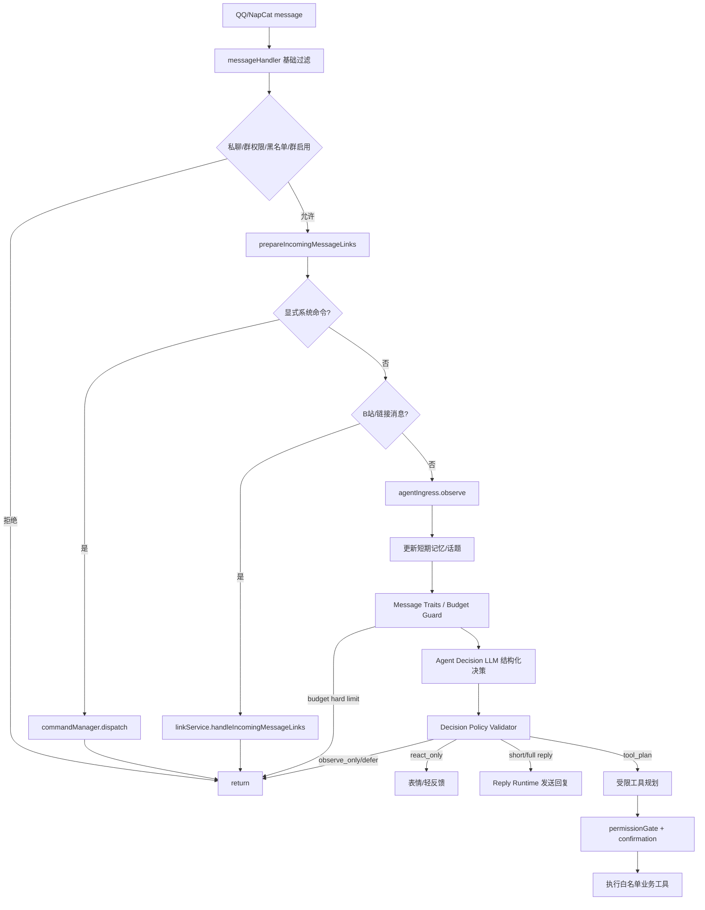

# Agent Runtime Redesign Plan

> 目标：在旧 AI/MCP 已移除的基础上，从零设计一个适合 QQ 群聊的拟人化 Agent。本文只描述新架构，不复用旧 AI/MCP 代码，也不引入 MCP。

## 1. 设计结论

当前项目更适合把 AI Agent 设计成“群聊观察者 + 谨慎参与者 + 受限业务操作者”，而不是传统“收到消息即回复”的 ChatBot。

新的 Agent 入口应位于 `src/handlers/messageHandler.js` 的命令分发和链接处理之后：

1. 系统显式命令仍然由 `src/commands/index.js` 分发，保持确定性和可审计。
2. B 站链接、订阅、下载等原有功能仍走现有 handler/service，不让 Agent 抢占。
3. Agent 只接收剩余自然语言消息，先观察并更新记忆，再决定是否回复、反应、延迟或执行受限工具。
4. Agent 的自我管理能力只通过白名单业务工具暴露，不允许任意文件写入、shell、源码修改、动态 MCP 接入。

## 2. 从 Hermes Agent 借鉴的机制

参考目录：`~/.hermes/hermes-agent`。只借鉴架构思想，不复制实现。

### 2.1 MemoryManager / MemoryProvider

Hermes 的 `agent/memory_manager.py` 把记忆能力集中到一个 manager：

- Builtin provider 始终存在。
- 最多允许一个 external provider，避免工具 schema 膨胀和记忆后端冲突。
- 生命周期包含 `prefetch`、`queue_prefetch`、`sync_turn`、`on_pre_compress`、`on_session_end`。
- 记忆上下文被包在 `<memory-context>` 中，并明确声明“不是新的用户输入”。
- provider 输出会被清洗，避免用户伪造 memory-context 或 system note。

本项目可借鉴为：

- `AgentMemoryManager` 统一管理短期/长期记忆，不让回复生成器直接访问存储细节。
- 长期记忆初期只实现 builtin provider，后续如需向量库也最多接一个 provider。
- 注入 LLM 的记忆必须带 fence，防止群友通过聊天内容伪造系统上下文。

### 2.2 ContextEngine / ContextCompressor

Hermes 的 `agent/context_engine.py` 把上下文压缩从主流程中抽离：

- 单一 active context engine。
- 生命周期包含 `on_session_start`、`update_from_response`、`should_compress`、`compress`、`on_session_end`。
- 压缩不是简单截断，而是受 engine 策略控制。

本项目可借鉴为 `TopicContextEngine`：

- QQ 群聊不是单线对话，必须按话题分流。
- 每个群维护多个 active topics，每个 topic 有最近消息、参与者、摘要、活跃度和最后更新时间。
- 压缩对象应是“话题”，不是整个群最近 N 条消息。

### 2.3 PromptBuilder

Hermes 的 `agent/prompt_builder.py` 把 identity、platform hints、memory guidance、skills/context files 分段组装。

本项目可借鉴为：

- Persona、平台行为、群聊礼仪、权限边界、工具规则分块组装。
- 不把所有规则写成一个巨大 prompt。
- 加载任何用户可编辑文本作为上下文前，先做 prompt injection 扫描或转义。

### 2.4 Gateway Session / SessionContext

Hermes 的 gateway 层用 `SessionSource`、`SessionContext` 表达平台、chat_id、chat_type、user_id、thread_id、chat_topic，并支持 `shared_multi_user_session`。

本项目可借鉴为 `AgentSessionContext`：

- `platform`: `qq` / `onebot` / `napcat`
- `chatType`: `group` / `private`
- `groupId`、`userId`、`messageId`、`selfId`
- `topicId`: 话题分流后的上下文 ID
- `isSharedMultiUserSession`: 群聊恒为 true
- `actor`: 当前发言人的权限快照

### 2.5 ContextVar / AsyncLocalStorage

Hermes 的 `gateway/session_context.py` 使用 Python `ContextVar`，避免并发会话污染全局状态。

本项目是 Node.js，可用 `AsyncLocalStorage` 实现同类能力：

- 每条消息进入 Agent runtime 时绑定 `AgentSessionContext`。
- 日志、工具、记忆写入都从当前 async context 读取 trace/session 信息。
- 避免多个群并发处理时互相串 session、权限或 pending action。

### 2.6 File Safety / Hooks / Trajectory

Hermes 的 `agent/file_safety.py`、`agent/shell_hooks.py`、`agent/trajectory.py` 对本项目有三个启发：

- 不给 Agent 原始文件系统权限，只给业务工具；如果未来必须写文件，也必须有 safe root 和 denylist。
- 工具调用前需要统一 gate，可阻断高风险动作。
- 保存 agent run 轨迹，用于解释“为什么回/为什么不回/为什么调用工具”。

本项目可落地为：

- `permissionGate + riskPolicy + confirmationStore + auditLog`。
- `data/agent/runs/*.jsonl` 记录 observe、score、decision、toolPlan、toolResult。
- 轨迹默认不保存完整敏感内容，只保存摘要、分数、原因和 action ID。

## 3. 本项目新目录建议

```text
src/agent/
  index.js
  ingress/
    agentIngress.js
    messageNormalizer.js
    triggerDetector.js
  session/
    agentSessionContext.js
    actorResolver.js
  cognition/
    relevanceScorer.js
    replyDecision.js
    personaPolicy.js
    contextBuilder.js
  memory/
    memoryManager.js
    shortTermStore.js
    longTermStore.js
    topicContextEngine.js
    memoryConsolidator.js
  runtime/
    agentRuntime.js
    llmClient.js
    promptBuilder.js
    planner.js
    trajectoryRecorder.js
  tools/
    registry.js
    permissionGate.js
    riskPolicy.js
    confirmationStore.js
    configTools.js
    subscriptionTools.js
    groupTools.js
  config/
    agentConfig.js
    personaConfig.js
```

原则：

- 不恢复旧 `src/services/ai/**`。
- 不恢复旧 MCP manager。
- Agent 是新的一等模块，旧服务只通过白名单工具被调用。
- WebUI 的 Agent 配置后续应是“新 Agent 配置”，不要把旧 AI/MCP 面板加回来。

## 4. 消息处理流程



## 5. 核心数据结构

### 5.1 AgentMessage

```js
{
  id: 'message_id',
  groupId: '123',
  userId: '456',
  selfId: '789',
  messageType: 'group',
  rawText: '...',
  segments: [],
  normalizedText: '...',
  mentionsSelf: false,
  replyToSelf: false,
  timestamp: 1710000000000,
  sender: {
    nickname: '...',
    card: '...',
    role: 'member|admin|owner|unknown'
  }
}
```

### 5.2 AgentSessionContext

```js
{
  platform: 'qq',
  groupId: '123',
  chatType: 'group',
  userId: '456',
  messageId: 'abc',
  topicId: 'topic_xxx',
  traceScope: '...',
  isSharedMultiUserSession: true,
  actor: {
    isRoot: false,
    isConfiguredGroupAdmin: false,
    qqRole: 'member',
    canManageGroupConfig: false,
    canManageSubscriptions: false,
    canManageGlobalConfig: false
  }
}
```

### 5.3 DecisionResult

```js
{
  action: 'observe_only|react_only|short_reply|full_reply|ask_clarify|tool_plan|defer',
  score: 0.72,
  reasons: ['mentioned_bot', 'topic_relevant', 'cooldown_ok'],
  penalties: ['crowded_chat'],
  topicId: 'topic_xxx',
  cooldownMs: 30000,
  toolIntent: null
}
```

### 5.4 MemoryItem

```js
{
  id: 'mem_xxx',
  scope: 'global|group|user|relation|topic',
  groupId: '123',
  userId: '456',
  type: 'fact|preference|relation|episode|persona',
  content: '...',
  confidence: 0.8,
  sourceMessageIds: ['...'],
  createdAt: 1710000000000,
  updatedAt: 1710000000000,
  expiresAt: null
}
```

### 5.5 PendingAction

```js
{
  id: 'act_xxx',
  groupId: '123',
  userId: '456',
  requestedBy: '456',
  toolName: 'subscription.add',
  args: {},
  risk: 'low|medium|high',
  requiredPermission: 'manage_subscriptions',
  status: 'pending|confirmed|cancelled|expired|executed',
  expiresAt: 1710000300000,
  originalMessageId: '...'
}
```

## 6. 回复准入与 Agent 自主决策

回复判断最终应交给 Agent/LLM 自己做语义决策，但不能让 LLM 越过安全边界。推荐采用两层结构：

```text
System Router / Hard Boundary
  ↓
Agent Ingress
  ↓
Context / Memory / Message Traits
  ↓
Budget Guard
  ↓
Agent Decision LLM
  ↓
Decision Policy Validator
  ↓
Reply Runtime / Tool Planner
```

### 6.1 System Router / Hard Boundary：系统路由和硬边界

硬编码规则不应替 Agent 判断一条自然语言消息是否无聊、垃圾、拥挤或值得回复。它只负责系统路由、权限硬拒绝和成本硬限制。

System Router / Hard Boundary 负责：

- 显式命令继续走 `commandManager`，不交给 Agent。
- B 站/链接消息继续走 `linkService`，不交给 Agent。
- 私聊管理员审批、系统通知等确定性事件走专用 handler。
- 黑名单、群禁用、Agent 未启用：硬拒绝，不进入 Agent。
- pending confirmation：优先进入确认流程，不让 LLM 重新解释。
- 预算硬限制：由独立 Budget Guard 控制是否允许本次调用 LLM。

System Router / Hard Boundary 不负责：

- 判断短消息是不是垃圾。
- 判断群聊拥挤时是否应该沉默。
- 判断自然语言是否值得回复。
- 决定回复语气和拟人化参与程度。
- 判断复杂含义，例如玩笑、暗示、群聊社交上下文。

原则：除明确系统指令、链接处理、权限硬拒绝、预算硬限制外，所有自然语言消息都应进入 Agent；规则只提供上下文特征，不替 Agent 做语义裁决。

### 6.2 Agent Decision LLM：语义参与判断

LLM 负责基于人格、上下文、短期记忆、群聊节奏和用户关系，自主判断是否参与。

核心系统要求：

```text
你不是每条消息都要回复。
你是群聊中的一个成员。
沉默是常见且正确的选择。
如果消息和你无关、群聊正在多人快速交流，通常观察即可。
如果用户明确 @ 你、回复你、叫你的名字，通常应该认真判断是否回应。
如果涉及配置、订阅或管理，不要直接执行，先输出 tool_plan 意图，等待权限和确认系统处理。
```

LLM 输出必须是结构化 JSON：

```json
{
  "action": "observe_only|react_only|short_reply|full_reply|ask_clarify|tool_plan|defer",
  "confidence": 0.0,
  "reason": "为什么这样决定",
  "topic": "当前话题标签",
  "replyStyle": "none|friendly_brief|explain|clarify|serious",
  "replyDraft": "可选回复草稿，observe_only/defer 时为空",
  "memoryHints": [],
  "toolIntent": null
}
```

示例：

```json
{
  "action": "short_reply",
  "confidence": 0.91,
  "reason": "用户明确 @ 我并要求介绍自己，应当简短回应。",
  "topic": "bot_identity",
  "replyStyle": "friendly_brief",
  "replyDraft": "我是这个群里的 Bilibili 助手，主要负责解析 B 站链接、订阅动态提醒和部分群配置管理。现在还在观察模式，不会主动插话。",
  "memoryHints": [],
  "toolIntent": null
}
```

### 6.3 Decision Policy Validator：防越权

LLM 可以表达“我想回复/我想调用工具”，但代码必须二次校验。

Validator 负责：

- action 是否在允许集合内。
- confidence 是否达到发送阈值。
- 是否仍处于 observeOnly。
- 是否命中冷却、拥挤、重复回复限制。
- replyDraft 是否过长、是否为空、是否包含明显风险内容。
- toolIntent 是否在白名单工具内。
- actor 是否有权限。
- medium/high risk 是否需要 pending confirmation。

LLM 永远不能直接决定：

- 自己有权限。
- 可以跳过确认。
- 可以修改源码或配置文件。
- 可以执行 shell。
- 可以接入 MCP。

### 6.4 推荐动作集合

- `observe_only`: 只记忆，不回复。默认动作。
- `react_only`: 发一个表情或轻反馈，不展开话题。
- `short_reply`: 一两句话参与。
- `full_reply`: 被明确询问、需要解释或总结时才使用。
- `ask_clarify`: 信息不足但确实需要跟进。
- `tool_plan`: 用户表达了配置/订阅/管理意图。
- `defer`: 当前群聊太拥挤或不适合插话，延后观察。

### 6.5 Message Traits 的定位

规则特征仍有价值，但只作为 Agent 的上下文输入，不作为最终语义裁决。

建议把当前 `relevanceScorer` 逐步改成 `messageTraits`：

```text
messageTraits = {
  mentionedBot,
  aliasMatched,
  replyToBot,
  questionLike,
  managementTopic,
  tooShort,
  lowInformation,
  possibleSpam,
  crowdedChat,
  cooldownActive,
  privilegedActor
}
```

处理方式：

- 过短、低信息、疑似垃圾消息：进入 Agent，但作为 `tooShort` / `lowInformation` / `possibleSpam` traits 提供给 LLM，由 Agent 判断 `observe_only` / `defer`。
- 群聊过度拥挤：进入 Agent，但将 `chatPace` / `crowdedChat` 提供给 LLM，由 Agent 判断是否沉默或延迟。
- 成本限制：由独立 Budget Guard 控制，不和语义判断混在一起。

例如 `@Bot 介绍一下你自己` 不应该由硬编码分数最终拒绝，而应进入 LLM decision，让 Agent 自己判断这是明确请求。

## 7. 记忆设计

### 7.1 短期记忆

存储建议：内存 + 定期落盘 JSON，Phase 1 不引入数据库。

每个群维护：

- 最近消息窗口：例如 100 条或 30 分钟。
- 活跃话题：topicId、summary、participants、lastActiveAt、messageIds。
- Bot 状态：最近回复时间、最近被 @ 时间、冷却、正在等待确认的 action。
- 群聊节奏：单位时间消息数、活跃人数、是否拥挤。

关键点：

- 群聊人数多时，不能只按时间线拼上下文。
- 新消息必须先归入 topic，再由 topic 取上下文。
- Bot 回复应引用当前 topic，而不是整个群最近消息。

### 7.2 长期记忆

Phase 2 建议用 SQLite：

- `agent_memories`: 结构化记忆。
- `agent_memory_sources`: 记忆来源消息。
- `agent_relations`: 用户关系和偏好。
- `agent_topic_summaries`: 群话题摘要。
- FTS5：先支持关键词检索，暂不引入 embedding。

不建议一开始就做向量库：

- 当前更关键的是准入策略、话题分流、权限安全。
- embedding 会增加依赖、配置、隐私和调试成本。
- 等 Phase 2 稳定后再评估是否加入。

## 8. 自我管理与工具边界

Agent 可以“管理 Bot”，但只能通过业务工具，不能直接改源码或执行命令。

允许工具示例：

- `group.enableFeature(groupId, featureName)`
- `group.disableFeature(groupId, featureName)`
- `group.setDownloadEnabled(groupId, enabled)`
- `subscription.add(groupId, uid)`
- `subscription.remove(groupId, uid)`
- `subscription.list(groupId)`
- `blacklist.addGroupUser(groupId, userId)`
- `blacklist.removeGroupUser(groupId, userId)`
- `config.setGroupAdmin(groupId, userId)`
- `config.unsetGroupAdmin(groupId, userId)`

禁止能力：

- 任意 shell。
- 任意文件读写。
- 修改 `src/**`、`package.json`、`Dockerfile`、`docker-compose.yml`。
- 修改 `.env` 中密钥类字段。
- 动态加载 MCP server。
- 任意 HTTP 请求。
- 读取本机敏感路径。

工具实现原则：

- 复用现有 service/config 方法，避免 Agent 自己写 JSON 文件。
- 复用 Dashboard API 的校验规则，或把校验逻辑抽到共享 service。
- 每次工具执行写审计日志：谁、在哪个群、为什么、执行了什么、结果如何。

## 9. 权限模型

权限来源分四层：

| Level | 来源 | 能力 |
| --- | --- | --- |
| 0 | 普通群成员 | 聊天、查询、提出请求 |
| 1 | `config.groupConfigs[groupId].admins` | 管理本群 Bot 配置、订阅 |
| 2 | QQ 群管理员/群主 | 基于 QQ 权限管理本群配置 |
| 3 | `ADMIN_QQ` Root Admin | 全局配置、跨群管理、高风险操作 |

需要新增 `actorResolver`：

- 从现有 `config.isRootAdmin(userId)` 判断 root。
- 从现有 `config.isGroupAdmin(groupId, userId)` 判断配置管理员。
- 从 NapCat/OneBot `messageData.sender.role` 判断 QQ 角色。
- 如果 `sender.role` 缺失，再考虑通过 OneBot API 查询群成员信息。

权限判断建议：

- `canManageSubscriptions`: root、配置群管理员、QQ 管理员/群主。
- `canManageGroupConfig`: root、配置群管理员、QQ 管理员/群主。
- `canManageGlobalConfig`: root only。
- `canExecuteHighRisk`: root 或 QQ 群主/管理员 + 二次确认，具体看 action。

## 10. 风险与确认机制

按风险分级：

- Low：查询类、解释类、列出订阅、列出配置。可直接执行。
- Medium：新增/删除订阅、修改本群普通功能开关。需要“确认/取消”。
- High：关闭整个群 Bot、移除管理员、拉黑、全局配置。需要更高权限 + 明确确认。

确认流程：

1. Agent 识别工具意图，但不立即执行 medium/high。
2. 创建 `PendingAction`，回复用户“将执行 X，回复 确认/取消”。
3. 后续消息先进入 `confirmationStore.tryConsume()`。
4. 确认消息必须同群、同用户、未过期、权限仍满足。
5. 执行后写审计日志和 trajectory。

## 11. WebUI 关系

旧 AI/MCP 配置已经移除，暂时不要恢复。

新 Agent 的 WebUI 应分阶段加入：

- Phase 1：无 WebUI，只通过配置文件开关和日志观察。
- Phase 2：只读观测页，展示 Agent 决策统计、observe/reply 比例、最近拒绝回复原因。
- Phase 3：可配置 persona、每群 Agent 开关、冷却参数、工具权限策略。
- Phase 4：记忆管理页，允许 root 查看/删除/禁用记忆条目。

WebUI 不应提供 MCP 配置入口。

## 12. 实施路线

### Phase 1：只观察，不回复

目标：安全接入，不影响现有功能。

范围：

- 新增 `src/agent` 基础目录。
- 在 `messageHandler` 命令和链接之后调用 `agentIngress.observe()`。
- 实现 `messageNormalizer`、`actorResolver`、`shortTermStore`、`topicContextEngine`、`relevanceScorer`。
- 只输出日志和 trajectory，不发消息、不调用 LLM、不改配置。

验收：

- 原命令、链接、订阅、下载行为不变。
- 群聊普通消息会记录 observe/score/decision。
- 默认 decision 基本为 `observe_only`。

当前状态：已实现并已通过本地 Docker + QQ 群真实消息验证。

### Phase 1.5：LLM 自主决策，只记录不发送

目标：把“该不该回复”的语义判断交给 Agent/LLM，但仍不实际发言。

范围：

- 新增 `llmClient`，支持 OpenAI-compatible chat completions。
- 新增 `promptBuilder`，分段组织 persona、平台礼仪、message traits、短期话题上下文。
- 新增 `agentDecisionService`，要求 LLM 输出结构化 JSON。
- 新增 `decisionSchema` / validator，校验 action、confidence、replyDraft、toolIntent。
- 保留当前 rule scorer 的特征提取能力，但改名或定位为 `messageTraits`；不要用它提前丢弃自然语言消息。
- trajectory 同时记录 `messageTraits`、`budgetDecision` 和 `llmDecision`。
- `observeOnly=true` 时，即使 LLM 认为应回复，也只记录 `wouldSend=true` 和 `replyDraft`，不发送。

验收：

- `@Bot 介绍一下你自己` 应得到 LLM action=`short_reply` 或 `full_reply`，但不发出。
- 普通闲聊如 `hello`、`好想玩原神哇` 大多数应为 `observe_only`。
- 日志能对比 message traits 与 LLM decision，方便调整 prompt、成本控制和 validator。
- LLM 输出异常、超时、JSON 解析失败时，回退到 observe_only，不影响原消息链路。

### Phase 2：回复草稿 + 发送闸门

目标：允许 Agent 生成拟人化回复草稿，但先通过 policy validator 控制是否发送。

范围：

- `ReplyRuntime` 读取通过校验的 `replyDraft`。
- 增加发送阈值，例如 confidence、冷却、群聊拥挤、重复发言限制。
- 支持 `short_reply` / `full_reply` / `ask_clarify`。
- 仍不开放工具调用。
- 支持全局和群级 `sendEnabled`，默认关闭。

验收：

- 不会每条消息都回。
- 高并发群聊中能稳定沉默。
- 被明确询问时能结合短期话题上下文回答。
- 发送失败不会阻断消息链路。

当前状态：已实现 `ReplyRuntime`、`short_reply` / `full_reply` / `ask_clarify` 发送闸门、confidence 校验、全局/群级 `sendEnabled`、5 秒发送冷却和重复回复拦截；LLM JSON 解析失败会自动进行一次修复重试；仍保持工具调用关闭，`tool_plan` 留到 Phase 4。

### Phase 3：长期记忆

目标：降低群聊混乱和重复自我介绍。

范围：

- Phase 3.1 先使用 `data/agent/memory/memories.json` 文件存储长期记忆，不引入向量库。
- 保存 LLM 输出的 `memoryHints`，包含 scope/type/content/confidence/sourceMessageIds/createdAt/updatedAt/expiresAt。
- 记忆注入 prompt 前使用 `<memory-context>` fencing，避免被当成新用户输入。
- 对记忆内容做敏感字段过滤和 prompt-injection 文本转义。
- 后续 Phase 3.2 再评估 SQLite、话题摘要定期固化和更强检索能力。

验收：

- 能记住稳定偏好，不把不同用户混淆。
- 能解释记忆来源和置信度。
- root 可清理错误记忆。

### Phase 4：受限工具与自我管理

目标：让 Agent 通过自然语言管理 Bot 的部分业务配置。

范围：

- `tools/registry`。
- `permissionGate`、`riskPolicy`、`confirmationStore`。
- 订阅、群配置、黑名单等工具。
- 审计日志。
- LLM 只能输出 `tool_plan`，实际执行必须由 validator + permissionGate 决定。

验收：

- 普通用户不能越权管理。
- QQ 管理员/群主可管理本群配置。
- 高风险动作必须确认。
- Agent 不能修改程序本身。

### Phase 5：WebUI Agent 管理

目标：可视化观测和配置。

范围：

- Agent 开关。
- LLM decision 观测页。
- Persona 参数。
- 决策日志。
- 记忆管理。
- 工具权限策略。

验收：

- WebUI 只展示新 Agent，不恢复旧 AI/MCP。
- 支持 root 审核 Agent 行为。

## 13. 最小配置建议

Phase 1 配置应尽量少：

```json
{
  "agent": {
    "enabled": false,
    "observeOnly": true,
    "logTrajectory": true,
    "defaultGroupEnabled": false,
    "aliases": [],
    "shortTerm": {
      "maxRecentMessagesPerGroup": 100,
      "topicIdleMs": 1800000,
      "crowdedMessagesPerMinute": 8
    },
    "replyPolicy": {
      "minReplyScore": 0.72,
      "cooldownMs": 30000
    },
    "groups": {}
  }
}
```

Phase 1.5 增加 LLM decision 配置，但仍不发送：

```json
{
  "agent": {
    "enabled": true,
    "observeOnly": true,
    "decisionMode": "llm_shadow",
    "sendEnabled": false,
    "llm": {
      "enabled": true,
      "provider": "openai-compatible",
      "baseURL": "https://api.example.com/v1",
      "model": "model-name",
      "apiKeyEnv": "AGENT_API_KEY",
      "timeoutMs": 12000
    }
  }
}
```

说明：

- `enabled: false`：默认不启用，避免影响当前生产行为。
- `observeOnly: true`：观察/影子决策阶段不发送。
- `sendEnabled: false`：Phase 1.5 即使有 replyDraft 也不发送。
- `defaultGroupEnabled: false`：每群显式开启。
- `apiKeyEnv` 只引用环境变量名，不把密钥写入 `config/config.json`。
- Phase 1 不需要 LLM key；Phase 1.5 才需要 OpenAI-compatible API。

## 14. 验证计划

每个阶段都要保护现有能力：

- `messageHandler` 单元测试：命令优先、链接优先、黑名单、群禁用逻辑不变。
- Agent Phase 1 测试：普通消息进入 observe，命令/链接不进入或只标记 ignored_by_system_handler。
- 权限测试：root、配置群管理员、QQ 管理员、普通成员分别覆盖。
- 确认测试：同用户确认、不同用户确认、过期确认、权限变化后确认。
- 工具测试：只调用白名单 service，不直接写源码/执行 shell。
- Dashboard 回归：旧 AI/MCP 面板不回归，新 Agent 页面后续单独实现。

## 15. 主要风险

- 群聊话题分流难度高：应先用规则 + 最近窗口，不急着上复杂语义聚类。
- LLM 回复容易过度积极：必须先实现准入策略和冷却，再接 LLM。
- 自我管理存在越权风险：必须先有 actorResolver、permissionGate、confirmationStore。
- 长期记忆可能污染：必须有来源、置信度、过期、删除机制。
- WebUI 过早配置化会拖慢核心闭环：应先跑 observe 日志验证决策质量。

## 16. 推荐下一步

当前 Phase 1 已经落地并在 QQ 群真实消息中验证：消息可以进入 `AGENT observe-decision`，trajectory 能记录 rule score、reason、actor 和 topic；下一步要把 rule score 降级为 message traits。

下一步建议实现 Phase 1.5：`LLM 自主决策，只记录不发送`。

优先实现点：

- `runtime/llmClient.js`: OpenAI-compatible 调用封装，支持 timeout 和错误回退。
- `runtime/promptBuilder.js`: 分段构建 persona、群聊礼仪、message traits、短期上下文。
- `cognition/agentDecisionService.js`: 调 LLM 输出结构化 decision。
- `cognition/decisionSchema.js`: 校验 action、confidence、replyDraft、toolIntent。
- `runtime/trajectoryRecorder.js`: 同时记录 message traits、budget decision 和 llm decision。
- `agentConfig`: 增加 `decisionMode=rule_only|llm_shadow|llm_live`、`sendEnabled=false`、`llm` 配置。

Phase 1.5 的目标不是让 Bot 开始说话，而是用真实群聊流量验证：

- LLM 是否比手写规则更懂“该不该回”。
- 普通闲聊是否能保持沉默。
- @Bot/明确请求是否能给出合理 replyDraft。
- prompt 是否会让 Agent 过度积极。
- JSON 输出、超时和异常回退是否稳定。

通过 Phase 1.5 后，再进入 Phase 2：打开受控发送闸门。
