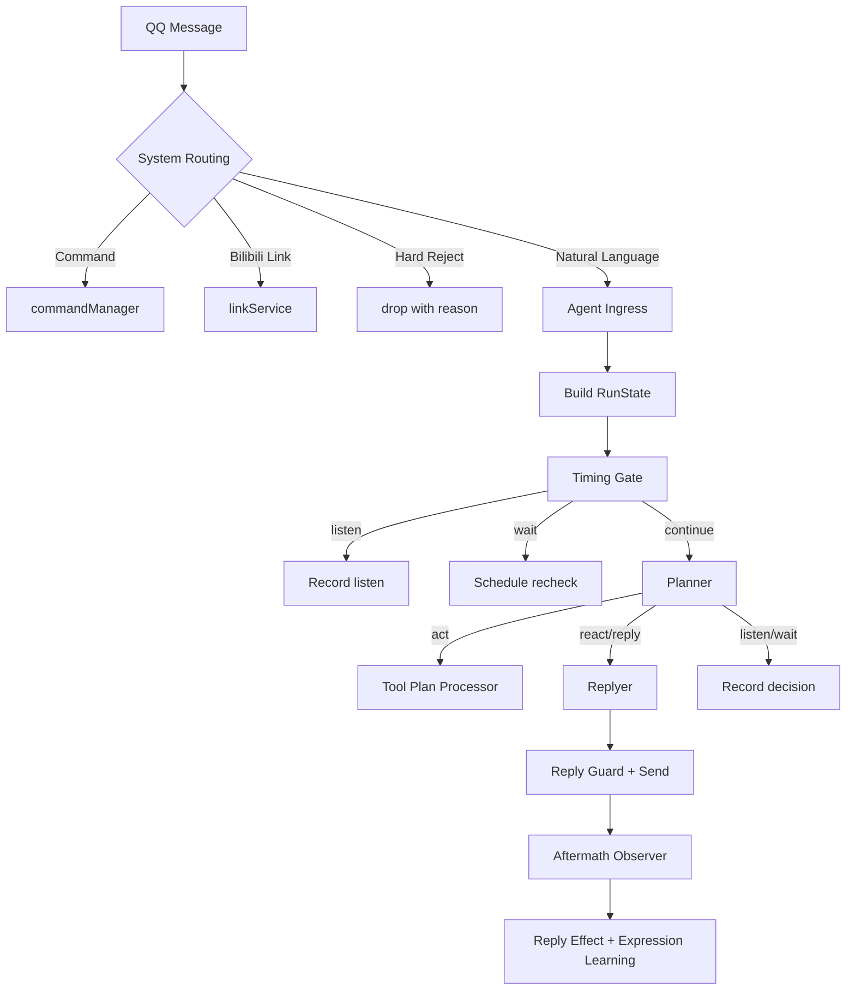

# Agent 拟人化参与机制改造计划

> 目标：把当前 Agent 从“判断回复/不回复”的二分类模式，升级为“像群成员一样管理参与节奏”的多阶段机制。该方案参考 MaiBot 的 planner/replyer/timing gate/expression learning 思路，但不复用 MaiBot GPL 代码，只借鉴架构思想并在本项目内重新实现。

## 0. 当前落地状态

- 已完成：P0 动作模型与 Replyer 最小闭环，运行时主动作切换为 `listen/wait/react/reply/act`。
- 已完成：P1 Timing Gate 前置节奏判断，明确寻址强制 `continue`，普通群聊可 `listen/wait`。
- 已完成：trajectory 记录并展示 `timing_gate`、`llm_decision`、`replyer`、`reply_sent` 链路。
- 已完成：表达习惯学习与注入、当前用户画像聚合、回复效果观察与表达置信度反哺的最小闭环。
- 待继续：`wait` 目前是本轮静默，不是延迟重入调度；WebUI 配置收口和更完整的画像/效果页面仍在后续阶段。


## 1. 背景与问题

当前 Agent 已经具备 LLM 决策、上下文、记忆、工具、网页读取/搜索/截图、QQ 管理和社交插话能力，但拟人化仍有几个结构性问题：

1. **回复动作过粗**：自然语言最终容易落到 `reply / observe / tool_plan`，用户感知上像“回或不回”的机械判断。
2. **节奏判断不够独立**：群聊中用户连续发言、两人私聊、话题刚展开时，Agent 不应立刻决定回复，而应能等待或继续听。
3. **表达层和决策层耦合**：LLM 同时决定“该不该说”和“怎么说”，容易让回复理由污染最终文案，也难以单独优化口语化表达。
4. **目标消息绑定需要强化**：群聊多消息场景下，Agent 应明确本次回应目标，避免把历史消息当成当前请求。
5. **表达习惯缺少自学习闭环**：现有 persona 是静态配置，长期记忆偏事实，缺少“这个群一般怎么说话”的表达风格记忆。
6. **回复效果没有反哺策略**：Bot 发言后，如果用户纠正、冷场或继续互动，目前未形成稳定反馈指标来调节后续插话和表达。

## 2. 设计原则

1. **自然语言都进入 Agent，规则不替 Agent 做语义裁决**：命令和 B 站链接仍走确定性 handler；其余自然语言进入 Agent，由 Agent 结合上下文判断参与方式。
2. **硬边界仍由系统控制**：黑名单、群禁用、Agent 未启用、预算耗尽、权限不足、危险工具确认等仍由系统硬拒绝。
3. **从二分类变成动作空间**：不要只问“回不回”，而是判断“现在应该怎样参与”。
4. **先节奏，后规划，再表达**：Timing Gate 负责聊天节奏；Planner 负责参与策略和工具计划；Replyer 负责最终拟人化文本。
5. **低风险渐进落地**：优先改内部 action schema 和 prompt，不先大规模改 WebUI/存储；每阶段都保留回滚路径。
6. **可观测优先**：每个阶段都要把 timing/planner/replyer/表达习惯/效果评分写入 trajectory，便于 QQ 实测定位。

## 3. 目标动作模型

将 Agent 可见动作统一为以下语义动作：

| 动作 | 含义 | 是否发送消息 | 典型场景 |
| :--- | :--- | :--- | :--- |
| `listen` | 继续听，不参与，不算异常 | 否 | 群友闲聊、话题与 Bot 关联弱、无需插话 |
| `wait` | 等待一段时间后重新判断 | 否，暂缓 | 用户连续输入、问题没说完、多人抢话 |
| `react` | 轻量插一句，不展开 | 是 | 群聊氛围适合、想表达态度、低成本参与 |
| `reply` | 正式回复目标消息 | 是 | @Bot、回复 Bot、明确提问、需要解释 |
| `act` | 执行工具计划 | 视工具结果 | 网页读取、截图、订阅、配置、QQ 管理 |

与现有 action 的兼容映射：

| 新动作 | 现有近似动作 | 兼容策略 |
| :--- | :--- | :--- |
| `listen` | `observe_only` / `ignore` | 先映射到不发送，但 trajectory 记录新动作 |
| `wait` | `defer` | 先复用延迟机制，后续升级为可恢复 timing state |
| `react` | `reply` | 走新 replyer，但限制长度和展开程度 |
| `reply` | `reply` | 走新 replyer，目标消息必须明确 |
| `act` | `tool_plan` | 复用工具管线、权限和确认 |

## 4. 新运行链路



## 5. Phase 1：动作模型与 Schema 收敛

状态：已完成。


### 目标

把当前决策输出从“回复/沉默/工具”扩展为 `listen/wait/react/reply/act`，但外部行为尽量不变。

### 修改范围

- `src/agent/cognition/decisionSchema.js`
- `src/agent/cognition/decisionPolicyValidator.js`
- `src/agent/cognition/agentDecisionService.js`
- `src/agent/runtime/promptBuilder.js`
- `src/agent/runtime/trajectoryRecorder.js`
- `src/agent/runtime/trajectorySpans.js`
- 相关单测：`test/unit/agent-*`

### 关键设计

1. 新增 `participation` 字段：

```json
{
  "action": "listen|wait|react|reply|act",
  "targetMessageId": "",
  "topic": "",
  "relation": "direct|mentioned|ambient|unrelated",
  "participationLevel": 0.0,
  "reason": "",
  "styleHints": [],
  "toolPlan": null
}
```

2. 兼容旧字段：
   - 旧 `reply` 转为新 `reply`。
   - 旧 `tool_plan` 转为新 `act`。
   - 旧 `observe_only` 转为新 `listen`。
   - 旧 `defer` 转为新 `wait`。

3. `react` 与 `reply` 区分：
   - `react`：短、轻、可以不完整解释，适合偶尔插话。
   - `reply`：面向目标消息的正式回答。

### 验收

- 旧测试全部通过。
- WebUI Agent 决策页能看到新动作或兼容摘要。
- QQ 实测中 `@Bot` 仍稳定回复；普通闲聊可记录 `listen/react/wait`。

## 6. Phase 2：Timing Gate 独立化

状态：已完成最小闭环；延迟重入调度后续实现。


### 目标

在进入完整 Planner 前，先判断群聊节奏，避免每条消息都做完整回复决策。

### 修改范围

- 新增：`src/agent/timing/timingGate.js`
- 新增：`src/agent/timing/timingPromptBuilder.js`
- 新增：`src/agent/timing/timingStateStore.js`（可先内存态）
- 修改：`src/agent/runtime/agentRunner.js`
- 修改：`src/agent/runtime/promptBuilder.js`
- 修改：`src/agent/memory/shortTermStore.js`

### Timing Gate 输出

```json
{
  "timingAction": "continue|wait|listen",
  "waitMs": 0,
  "reason": "",
  "signals": {
    "directAddressed": false,
    "rapidConversation": false,
    "twoPersonChat": false,
    "userLikelyStillTyping": false,
    "topicOpenForBot": false
  }
}
```

### 规则

1. 强 @Bot、回复 Bot、明确叫昵称：默认跳过 timing gate 或强制 `continue`。
2. 普通自然语言：先进 timing gate。
3. 群聊短时间多条消息：优先 `wait`，静默窗口后再带整批消息进入 Planner。
4. 两人明显对话且未提及 Bot：优先 `listen`。
5. 有开放性群聊话题且社交模式开启：允许 `continue` 进入 Planner 判断是否 `react`。

### 验收

- 用户连续发 2-3 条消息时，Agent 不抢第一条回复。
- `@Bot` 不被 wait 阻断。
- trajectory 记录 timing decision。

## 7. Phase 3：Replyer 二阶段生成

状态：已完成最小闭环。


### 目标

把“参与策略”和“最终文案”拆开，Planner 不直接输出最终回复文本，只输出回复理由、目标消息和风格提示；Replyer 生成真实发送内容。

### 修改范围

- 新增：`src/agent/replyer/replyerService.js`
- 新增：`src/agent/replyer/replyerPromptBuilder.js`
- 修改：`src/agent/runtime/replyExecutor.js`
- 修改：`src/agent/runtime/outputGuardrails.js`
- 修改：`src/agent/runtime/agentRunner.js`
- 修改：`src/agent/context/contextSelector.js`

### Replyer 输入

```json
{
  "persona": {},
  "targetMessage": {},
  "recentMessages": [],
  "topicMessages": [],
  "plannerReason": "",
  "replyMode": "react|reply",
  "styleHints": [],
  "memoryHints": [],
  "expressionHints": []
}
```

### Replyer 输出

```json
{
  "text": "最终要发送的文本",
  "quoteTargetMessageId": "",
  "tone": "casual|helpful|dry|serious",
  "confidence": 0.0
}
```

### 约束

1. `react` 默认 8-60 字，不解释过多。
2. `reply` 默认可较完整，但仍受 `maxCasualReplyChars` / `maxReplyChars` 控制。
3. Replyer 不能生成 tool plan；工具只由 Planner 输出。
4. Replyer 不允许泄露 planner reason、JSON、内部错误。
5. 如果 replyer 空响应，系统用安全短句兜底，不能再出现“解析失败”类内部话术。

### 验收

- @Bot 问能力：正式 `reply`。
- 群聊闲聊：如果参与，更多表现为短 `react`。
- LLM 非 JSON 不影响最终用户可见文案。

## 8. Phase 4：表达习惯学习与注入

状态：已完成最小闭环；WebUI 独立管理页后续实现。

### 目标

让 Agent 学会“这个群怎么说话”，而不是只靠静态 persona。

### 数据结构

新增表达习惯记录，可先 JSON 存储，后续再迁移 SQLite：

```json
{
  "id": "",
  "groupId": "",
  "situation": "对某件事表示惊讶",
  "style": "用短句吐槽，不展开说教",
  "sourceMessageIds": [],
  "count": 1,
  "confidence": 0.7,
  "lastUsedAt": "",
  "createdAt": "",
  "updatedAt": ""
}
```

### 修改范围

- 新增：`src/agent/expression/expressionStore.js`
- 新增：`src/agent/expression/expressionLearner.js`
- 新增：`src/agent/expression/expressionSelector.js`
- 修改：`src/agent/replyer/replyerPromptBuilder.js`
- 修改：`src/agent/runtime/agentRunner.js`
- WebUI 后置：可先不做页面，只在 trajectory 展示选中的 expression IDs。

### 学习触发

1. 每群累计自然语言消息达到阈值，例如 20 条。
2. 或每 10 分钟检查一次有无足够新消息。
3. 排除 Bot 自己发言、命令、B 站链接、纯表情、明显垃圾消息。
4. LLM 提取 3-8 条候选：`situation + style + sourceMessageIds`。
5. 合并相似表达，增加 count，不直接无限新增。

### 注入策略

1. Replyer 前按当前上下文选择 0-3 条表达习惯。
2. `react` 比 `reply` 更积极使用表达习惯。
3. 严肃工具/管理/安全场景少用表达习惯。
4. 如果表达习惯后续造成负反馈，降低 confidence。

### 验收

- 群聊一段时间后生成表达习惯记录。
- Agent 回复可看到轻微群风格，但不生硬模仿具体用户。
- 不学习用户隐私、人身攻击、敏感词作为表达习惯。

## 9. Phase 5：人物画像聚合

状态：已完成当前用户画像聚合与 Replyer 注入；全量画像刷新和 WebUI 展示后续实现。

### 目标

把零散长期记忆聚合成“用户画像摘要”，用于减少群聊多人场景的混乱。

### 数据结构

```json
{
  "userId": "",
  "groupId": "",
  "displayNames": [],
  "preferences": [],
  "communicationStyle": [],
  "boundaries": [],
  "relationshipNotes": [],
  "confidence": 0.0,
  "updatedAt": ""
}
```

### 修改范围

- 新增：`src/agent/memory/personProfileStore.js`
- 新增：`src/agent/memory/personProfileBuilder.js`
- 修改：`src/agent/memory/memoryRetriever.js`
- 修改：`src/agent/runtime/promptBuilder.js`
- 修改：`src/agent/replyer/replyerPromptBuilder.js`

### 规则

1. 画像是长期记忆摘要，不替代原始记忆。
2. 画像每隔一段时间或记忆变更后增量刷新。
3. 画像必须保留来源记忆 ID，支持追溯。
4. 私密/敏感内容不进入群聊 replyer，或只在同群同用户上下文中使用。

### 验收

- 同一群多用户同时聊天时，Agent 能区分“谁是谁”。
- 用户偏好类信息不需要每次重新检索大量原始记忆。
- WebUI 记忆页后续可展示画像摘要和来源。

## 10. Phase 6：回复效果观察与反哺

状态：已完成最近一次回复效果观察、记录和表达习惯置信度反哺。

### 目标

Bot 发言后观察后续群聊反应，给该次回复打分，并用于调整表达习惯、插话概率和回复策略。

### 修改范围

- 新增：`src/agent/feedback/replyEffectTracker.js`
- 新增：`src/agent/feedback/replyEffectScorer.js`
- 新增：`src/agent/feedback/replyEffectStore.js`
- 修改：`src/agent/runtime/replyExecutor.js`
- 修改：`src/agent/social/socialInterjectScorer.js`
- 修改：`src/agent/expression/expressionStore.js`

### 评分信号

| 信号 | 含义 | 影响 |
| :--- | :--- | :--- |
| `continuedConversation` | 用户继续围绕话题说话 | 正向 |
| `targetUserResponded` | 目标用户继续回应 Bot | 正向 |
| `positiveFeedback` | 谢谢、懂了、可以、有用 | 正向 |
| `correction` | 不是、你没懂、我说的是 | 负向 |
| `explicitNegative` | 烦、别这样、无语 | 负向 |
| `silenceAfterReply` | 发言后短时间无人接 | 中性或轻负向 |
| `topicDerailment` | Bot 发言导致话题中断 | 负向 |

### 使用方式

1. 对 `react` 的负反馈应更敏感，降低后续插话概率。
2. 对 `reply` 的纠正反馈应提示记忆修正或输出策略修正。
3. 对表达习惯相关负反馈，降低 expression confidence。
4. 只做统计和策略调节，不自动删除重要记忆。

### 验收

- WebUI trajectory 能看到 reply effect 摘要。
- 用户纠正 Bot 后，后续同类表达减少。
- 正反馈较多的表达习惯被更稳定选中。

## 11. Phase 7：WebUI 与配置收口

### 目标

把新拟人化机制做成可配置、可观测、可回滚。

### 配置项建议

```json
{
  "agent": {
    "participation": {
      "enabled": true,
      "timingGateEnabled": true,
      "replyerEnabled": true,
      "expressionLearningEnabled": false,
      "replyEffectTrackingEnabled": true
    },
    "replyer": {
      "maxReactChars": 60,
      "maxReplyChars": 500,
      "allowQuoteReply": true
    },
    "timing": {
      "quietWindowMs": 2500,
      "maxWaitMs": 12000
    }
  }
}
```

### WebUI 展示

1. Agent 设置页：开关 `timingGate/replyer/expressionLearning/replyEffect`。
2. Agent 决策页：展示 timing → planner → replyer → send → effect 全链路。
3. Agent 记忆页：后续增加表达习惯和人物画像 tab。
4. 群级覆盖：允许不同群配置不同插话和表达学习强度。

### 验收

- 可以单独关闭 replyer 回退到旧模式。
- 可以单独关闭 expression learning。
- 可以在决策页定位为什么 wait/listen/react/reply。

## 12. 测试计划

### 单元测试

1. `decisionSchema`：新旧 action 兼容解析。
2. `timingGate`：@Bot 强 continue、连续消息 wait、两人聊天 listen。
3. `replyerPromptBuilder`：目标消息、planner reason、表达习惯注入正确。
4. `expressionLearner`：过滤 Bot 自己、命令、链接；合并相似表达。
5. `replyEffectScorer`：正/负反馈信号识别。
6. `trajectoryRecorder`：记录 timing/planner/replyer/effect。

### QQ 实测

1. 连续发送三条问题：Bot 应等用户说完再回复。
2. 群友互聊未 @Bot：Bot 多数 listen，不生硬插话。
3. 群友开放话题闲聊：社交模式开启后，Bot 偶尔 react。
4. `@Bot` 明确问题：必须 reply，不被 timing gate 拦截。
5. `@Bot 截图/搜索/总结网页`：走 act，不被 replyer 改写工具计划。
6. 用户说“不是这个意思”：后续同类回复应降低置信或调整策略。
7. 群聊一段时间后：表达习惯被学习并少量影响回复。

## 13. 风险与防护

| 风险 | 防护 |
| :--- | :--- |
| LLM 决策复杂度上升 | 分阶段上线，每阶段有配置开关和旧模式回退 |
| Agent 等待导致 @Bot 延迟 | 强 @Bot/回复 Bot 默认跳过 timing gate |
| 表达学习学坏 | 过滤敏感/攻击/隐私内容，低置信候选不注入 |
| 插话变多打扰群聊 | 社交预算、每日上限、负反馈降低概率 |
| Replyer 幻觉工具结果 | 工具结果和 replyer 分离，replyer 只能解释已有结果 |
| WebUI 难定位 | trajectory 记录全链路阶段和输入摘要 |

## 14. 推荐执行顺序

1. **先做 Phase 1 + Phase 3**：动作模型和 Replyer 二阶段，最快改善“回复生硬”。
2. **再做 Phase 2**：Timing Gate 独立化，改善抢话和连续消息。
3. **再做 Phase 6**：回复效果观察，用真实反馈调节 react/reply。
4. **最后做 Phase 4 + Phase 5 + Phase 7**：表达习惯、人物画像和 WebUI 完整化。

如果只做一个最小闭环，建议范围是：

- 新动作模型：`listen/wait/react/reply/act`
- Planner 只产出策略，不直接产出最终文案
- Replyer 生成最终文本
- trajectory 展示 planner/replyer 分离结果

这个闭环不依赖新存储，风险最低，也最能立刻减少“机械判断回不回”的体感。
