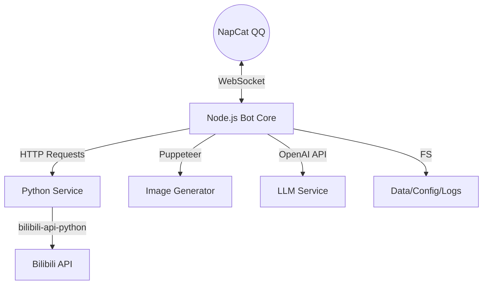

# Bili QQ Bot 项目逻辑分析文档

## 1. 项目概述
Bili QQ Bot 是一个基于 [NapCat](https://github.com/NapNeko/NapCatQQ) 框架开发的 QQ 机器人，专注于 Bilibili 内容解析与分享。它集成了智能 AI 对话（支持 RAG 和 MCP）、B 站全类型链接解析（视频、动态、直播、专栏等）以及订阅推送功能。

项目采用 **Node.js + Python** 的混合架构，Node.js 负责主逻辑与 QQ 交互，Python 负责调用 Bilibili API（利用 `bilibili-api-python` 库）。

## 2. 核心架构

### 2.1 整体架构图


### 2.2 关键模块

#### A. 入口与连接管理 (`src/bot.js`)
- **启动流程**：
  1. 启动 `ServiceManager` (拉起 Python 子进程)。
  2. 初始化 `mcpManager` (MCP 工具管理)。
  3. 建立 WebSocket 连接至 NapCat。
- **连接保活**：包含自动重连机制 (`reconnectCount`, `scheduleReconnect`) 和优雅退出处理 (`gracefulShutdown`)。
- **事件分发**：监听 WS 消息，区分群消息、私聊消息和通知（如群成员增加），分发给 `messageHandler`。

#### B. 消息处理 (`src/handlers/messageHandler.js`)
- **预处理**：
  - 过滤自身消息。
  - 权限校验：全局/群组黑名单检查、群组功能开关检查。
  - **虚拟群组**：私聊 Root 管理员的消息会被分配一个虚拟 `groupId` (`private_UserID`) 以复用群组逻辑。
- **内容提取**：
  - 支持普通文本链接提取。
  - 支持 JSON 卡片（小程序）解析，自动提取其中的 URL。
  - 支持短链 (`b23.tv`) 自动还原。
- **逻辑分流**：
  1. **指令处理**：`/` 开头的消息交给 `commandManager`。
  2. **链接解析**：提取 B 站链接 -> 查缓存 -> 调用 `biliApi` -> 生成预览图 -> 发送。
  3. **AI 对话**：若未触发指令或链接解析，且满足触发条件（@机器人或概率触发），交给 `aiHandler`。

#### C. Bilibili 服务桥接 (`src/services/ServiceManager.js` & `src/services/biliApi.js`)
- **架构**：为了利用 Python 丰富的 B 站 API 生态，项目在 Node.js 中通过 `child_process.spawn` 运行一个 Python HTTP 服务器 (`src/services/bili_service.py`，端口默认为 10001)。
- **ServiceManager**：
  - 负责 Python 进程的生命周期管理（启动、健康检查、崩溃自动重启）。
  - 实现“闲置重启”机制（24小时无请求自动重启以释放内存）。
- **biliApi**：
  - Node.js 侧的 SDK 封装。
  - 实现了 **缓存层 (`_withCache`)**：减少对 Python 服务的调用频率，缓存 API 响应结果。

#### D. 图片生成 (`src/services/imageGenerator/`)
- 基于 **Puppeteer** 实现，用于将 B 站内容渲染为精美的图片卡片。
- **模块化设计**：
  - `renderers/`: 负责生成 HTML (视频、动态、直播、用户等不同模板)。
  - `core/browser.js`: 浏览器实例池管理。
  - `generators/`: 业务逻辑封装 (如 `previewCard.js`)。

#### E. AI 智能体 (`src/handlers/aiHandler.js`)
- **核心功能**：处理与 LLM 的交互。
- **RAG (检索增强生成)**：
  - 用户的非指令消息会被存入向量数据库 (`vectorMemoryService`)。
  - 回复时，先进行向量搜索，将相关历史记忆注入 System Prompt。
- **MCP (模型上下文协议)**：支持通过配置文件让 AI 调用外部工具。
- **防注入与清洗**：内置了对 CQ 码、Prompt 注入攻击的清洗逻辑。

#### F. 订阅服务 (`src/services/subscriptionService.js`)
- 维护用户 (`userSubs`) 和番剧 (`bangumiSubs`) 的订阅列表。
- **轮询机制**：定时 (`updateChecker`) 调用 API 检查更新。
- **推送**：发现更新后，调用 `imageGenerator` 生成卡片并推送至相关群组。

## 3. 数据与配置
- **配置 (`config/`)**：
  - `.env`: 静态敏感配置 (Token, API Key, 端口)。
  - `config.json`: 运行时动态配置 (黑名单, 群组独立设置)，支持热更新。
- **数据 (`data/`)**：
  - `cache/`: API 响应缓存。
  - `vectors/`: AI 向量记忆库。
  - `subscriptions.json`: 订阅数据。

## 4. 目录结构说明
```text
/
├── config/             # 配置文件
├── data/               # 持久化数据
├── napcat/             # NapCat 客户端配置
├── src/
│   ├── bot.js          # 程序主入口
│   ├── commands/       # 指令处理器
│   ├── handlers/       # 消息与AI处理逻辑
│   ├── services/       # 核心服务
│   │   ├── biliApi.js        # B站API Node接口
│   │   ├── ServiceManager.js # Python进程管理
│   │   ├── bili_service.py   # Python API服务 (实际位置)
│   │   ├── imageGenerator/   # 图片生成服务
│   │   └── subscriptionService.js # 订阅服务
│   └── utils/          # 工具函数
├── scripts/            # 辅助脚本
└── setup.sh            # 部署脚本
```
